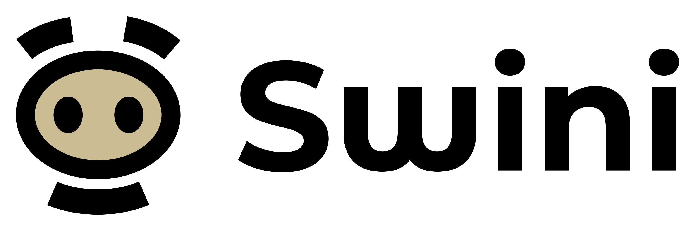

# Swini

<p align="center">
  
</p>

<p align="center">
  <a href="https://github.com/nosebit/swini/actions"></a>
  <a href="https://github.com/nosebit/swini/releases"></a>
  <a href="https://codecov.io/gh/nosebit/swini"></a>
</p>

Swini is like Kubernetes, but dirtier 🐷. It is a distributed workload orchestrator and supervisor that makes it easy to launch, scale, monitor and keep your applications running continuously across a set of machines.

The primary workload abstraction in Swini is called a **Pig**, a cluster-wide creature that "farrows" (spawns and places) identical siblings called _Piglets_ onto nodes across the cluster, actively supervising them to ensure they match a desired state at any time. A **Piglet** is a node-level creature responsible for executing and supervising one or more _Tasks_ inside the piglet **Yard**, a slice of the node resources reserved to that specific piglet. A **Task** is the smallest unit of work in Swini and can be a container, a process or other kind of workload.

The entire Swini infrastructure is powered by one or more **Daemons**, background processes running on host machines that communicate with each other to form a cluster and pool the total available computational resources, essentially turning the entire cluster into one big, powerful machine. To achieve this, every daemon establishes a logical **Node** to represent the computational resources of the underlying machine it runs on. This Node component of the daemon is responsible for tracking its available resources and continuously registering them into a central key-value store we call the **Barn**.

The **Barn** is powered by the Raft consensus protocol and distributes its data across a set of nodes called **Servers**, providing a consistent and highly available view of the entire cluster state. A special server node called the **Leader** is responsible for receiving all data write operations from any node in the cluster. When a new operation is received, the leader first propagates it to all other server nodes (called **Followers**). As soon as a majority of followers acknowledge they received the operation, the leader safely commits the data change to its local storage and then instructs the follower nodes to do the same. If the leader fails for any reason, a new leader is elected to finish committing any pending operations, guaranteeing no data is ever lost because every server maintains a complete, fully synchronized local copy of the store.

The cluster state is used by another daemon component called the **Drover** to ensure a Pig's desired state is respected across the cluster. The Drover running on the Barn leader node (also called the **Primary** node) is responsible for herding Piglets across the cluster. It finds a Node with enough available resources by checking the Raft store, carves out a properly sized **Yard** to reserve those resources, and places a single Piglet into that Yard. Once assigned, it delegates to the local Drover running on that specific Node to actively supervise the Piglet on behalf of the Pig.

## Quick Start

To start a swini deamon on a single machine with a default configuration you can simply run the following command:

```bash
swini daemon start
```

This will start the daemon as a foreground process by default but you can use the `--detached` flag to make it start as a background process. You can greatly configure the daemon by providing a configurarion file via the `--config` argument like this:

```bash
swini daemon start --config /path/to/swini.yml
```

The config file in its simplest form looks like this:

```yml
name: node-1
bind_address: "127.0.0.1:5001"
data_dir: "~/.swini"
server:
  enabled: true
worker:
  enabled: true
```

## Run a Pig

Swini looks very similar to docker-compose when it comes to how we define the pigs to be run. You first need to create a `pigs.yml` file specifying the pigs you want to run like this:

```yml
space: default
pigs:
  - name: web
    size: 2
    piglet:
      placement:
        yard:
          cpu: 1000
          memory: 512
      tasks:
        - name: main
          container:
            image: "nginx:latest"
```
