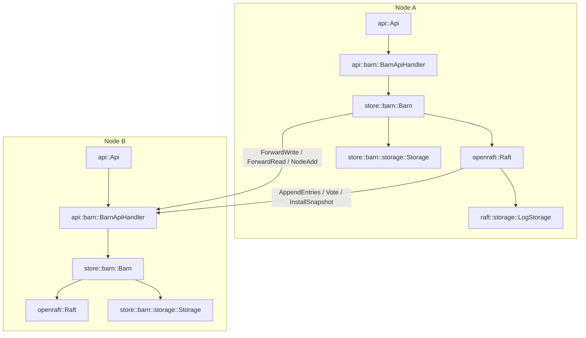

# [Plan] Complete the Barn Cluster Store

Barn becomes a concrete `ClusterStore`: a `Barn` struct that owns a live
`openraft::Raft<TypeConfig>` handle and a local `Storage` state machine,
implements `Store`/`ItemStore`/`SpreadStore`/`ClusterStore`, and forwards
raft's own membership/leader changes plus the state machine's applied
writes as `StoreEvent`s. A new `src/api` module hosts a generic gRPC
`Api` server; its first (and for now only) registered service is
`BarnApiHandler`, which answers the `BarnApi` contract already defined in
`proto/barn.proto` — the three raft transport RPCs, `ForwardWrite`/
`ForwardRead` (used whenever a request lands on a node that isn't who it
needs to be), and `NodeAdd` (cluster membership changes). See
[goal.md](./goal.md) for the product requirements this design satisfies.

## Architecture



New/updated files:

- `src/store/mod.rs` — add `pub use cluster::*;` (today `ClusterStore` is
  defined but never re-exported, so nothing outside `store::cluster` can
  actually name it).
- `src/store/spread.rs` — `SpreadNode` drops `name`/`fn name()`; identity
  is `id` + `api_addr` only (see below).
- `src/store/barn/raft/types.rs` — `Node` drops its `name` field to match.
- `src/store/barn/config.rs` — `Config` gains `node_id`, `api_addr`,
  `data_dir`.
- `src/store/barn/raft/config.rs` — `join_addresses` is removed (see
  Risks & Open Questions).
- `proto/barn.proto` — `NodeAddReq` drops its `name` field to match.
- `src/store/barn/events.rs` **(new)** — `Event`, Barn's concrete
  `ClusterStore::ClusterEvent` type.
- `src/store/barn/storage.rs` — adds a local read path and applied-write
  event emission.
- `src/store/barn/mod.rs` — the `Barn` struct, `spawn`, and the trait
  implementations; re-exports `Config`, `Event`, `Node`, `NodeRole`,
  `Action`, `ActionResult`, `ReadAction`, `ReadResult` — `raft` and
  `types` stay private submodules, never named from outside `store::barn`.
- `src/api/mod.rs` **(new)** — `Api`.
- `src/api/barn.rs` **(new)** — `BarnApiHandler`.
- `src/main.rs` — add `mod api;`.
- READMEs: `src/store/barn/README.md` and `src/store/barn/raft/README.md`
  need their "Current status" sections updated (Barn is no longer just
  foundational pieces once this lands); `src/api/README.md` is a new
  module README.

## Implementation Details

### `barn::Event` (`src/store/barn/events.rs`)

The concrete event type Barn emits — a flat enum, not a wrapper around
`ItemStoreEvent`/`SpreadStoreEvent`. It still satisfies
`ClusterStore::ClusterEvent`'s `TryInto<ItemStoreEvent<..>>` /
`TryInto<SpreadStoreEvent<..>>` bounds: those conversions just reconstruct
the generic wrapped shape from whichever flat variant matches, and fail
for variants that don't (a `NodeAdded` isn't an `ItemStoreEvent`, and vice
versa).

```rust
use crate::store::{ItemStoreEvent, SpreadStoreEvent};
use super::raft;

#[derive(Debug, Clone, PartialEq)]
pub enum Event {
  ItemCreated(String, Vec<u8>),
  ItemPatched(String, Vec<u8>),
  ItemRemoved(String),
  NodeAdded(raft::Node),
  NodeRemoved(raft::Node),
  NodeChanged(raft::Node),
}

impl TryFrom<Event> for ItemStoreEvent<String, Vec<u8>> {
  type Error = ();
  fn try_from(event: Event) -> Result<Self, Self::Error> {
    match event {
      Event::ItemCreated(k, v) => Ok(ItemStoreEvent::ItemCreated(k, v)),
      Event::ItemPatched(k, v) => Ok(ItemStoreEvent::ItemPatched(k, v)),
      Event::ItemRemoved(k) => Ok(ItemStoreEvent::ItemRemoved(k)),
      _ => Err(()),
    }
  }
}

impl TryFrom<Event> for SpreadStoreEvent<raft::Node> {
  type Error = ();
  fn try_from(event: Event) -> Result<Self, Self::Error> {
    match event {
      Event::NodeAdded(n) => Ok(SpreadStoreEvent::NodeAdded(n)),
      Event::NodeRemoved(n) => Ok(SpreadStoreEvent::NodeRemoved(n)),
      Event::NodeChanged(n) => Ok(SpreadStoreEvent::NodeChanged(n)),
      _ => Err(()),
    }
  }
}
```

### `SpreadNode` / `raft::Node` drop `name` (`src/store/spread.rs`, `src/store/barn/raft/types.rs`, `proto/barn.proto`)

Name-to-id mapping is going to live in a future "node" module, not in
Raft/Barn — a `SpreadNode`'s identity is just `id` + `api_addr` (where to
reach it). No other `SpreadNode` implementation exists yet, so this is a
clean change to the trait itself, not a Barn-only workaround.

```rust
// src/store/spread.rs
pub trait SpreadNode: Clone + Send + Sync + 'static {
  fn new(id: u64, api_addr: String) -> Self;
  fn id(&self) -> u64;
  fn api_addr(&self) -> String;
}
```

```rust
// src/store/barn/raft/types.rs
#[derive(Debug, Clone, Serialize, Deserialize, PartialEq, Eq, Default)]
pub struct Node {
  pub id: u64,
  pub api_addr: String,
  pub role: NodeRole,
  pub is_leader: bool,
}

impl SpreadNode for Node {
  fn new(id: u64, api_addr: String) -> Self {
    Self { id, api_addr, role: NodeRole::Voter, is_leader: false }
  }
  fn id(&self) -> u64 { self.id }
  fn api_addr(&self) -> String { self.api_addr.clone() }
}
```

`NodeAddReq` (the wire message carrying a `Node`'s identity into
`SpreadStore::node_add`) drops `name` to match:

```protobuf
message NodeAddReq {
  uint64 id = 1;
  string api_addr = 2;
}
```

### `Config` (`src/store/barn/config.rs`)

```rust
use std::path::PathBuf;
use super::raft;

#[derive(Debug, Clone)]
pub struct Config {
  pub node_id: u64,
  pub api_addr: String,
  pub data_dir: PathBuf,
  pub raft: raft::Config,
}
```

### `Storage`: local reads + applied-write events (`src/store/barn/storage.rs`)

`Storage` gains a `pub(super) fn read` for answering `ReadAction`s directly
against `DATA_TABLE_DEF`, and a broadcast channel so `apply_action` can emit
`ItemStoreEvent`s the moment a write is durably applied — on every node,
leader or follower, matching every other node's copy of the data.
`pub(super)`, not `pub(crate)`: `storage` is a child module of `barn`, so
plain module-private wouldn't even be visible to `Barn` in the parent
`mod.rs` — but nothing outside `store::barn` ever touches `Storage`
directly (`api::barn` only ever goes through `Barn::local_read`/
`local_write`), so there's no reason for this to reach further than its
immediate parent.

```rust
use crate::store::ItemStoreEvent;
use tokio::sync::broadcast;

#[derive(Clone)]
pub struct Storage {
  db: Arc<redb::Database>,
  events_tx: broadcast::Sender<ItemStoreEvent<String, Vec<u8>>>,
}

impl Storage {
  pub(super) fn subscribe(
    &self,
  ) -> broadcast::Receiver<ItemStoreEvent<String, Vec<u8>>> {
    self.events_tx.subscribe()
  }

  /// Answers a `ReadAction` directly from local data. Does not check
  /// leadership or staleness — that decision belongs to whoever calls this
  /// (`Barn::local_read`), not to storage itself.
  pub(super) fn read(&self, action: ReadAction) -> ReadResult {
    // ReadAction::Get -> single `data_table.get(key)` lookup.
    // ReadAction::List -> range-scan DATA_TABLE_DEF (same pattern already
    // used by `build_snapshot`), filtering by `key.starts_with(prefix)`.
  }
}
```

`apply_action` sends on `events_tx` after each successful mutation
(`Set`/`Patch` → `ItemCreated`/`ItemPatched`, `Delete` → `ItemRemoved`),
mapping 1:1 from `Action` variants — no separate translation table needed.

### `raft::Config` (`src/store/barn/raft/config.rs`)

```rust
#[derive(Debug, Clone)]
pub struct Config {
  pub heartbeat_interval: u64,
  pub election_timeout_min: u64,
  pub election_timeout_max: u64,
}
```

`join_addresses` is removed (see Risks & Open Questions). `raft::create`'s
signature is unaffected. The existing test helper in
`raft/mod.rs::tests::test_config` drops its `join_addresses: Vec::new()`
line.

### `Barn` (`src/store/barn/mod.rs`)

`config`, `events`, `raft`, `storage`, and `types` all stay private
submodules — nothing outside `store::barn` ever writes
`store::barn::raft::..` or `store::barn::types::..`. Everything an outside
caller (`api::barn`, and later the "node" module) needs is re-exported
flat at the `barn::` level instead: `Node`/`NodeRole` so a caller can name
the type `SpreadStore::node()`/`node_list()` return without knowing Barn
happens to be raft-based internally, and `Action`/`ReadAction` for the
forwarding RPC payloads.

```rust
mod config;
mod events;
mod raft;
mod storage;
mod types;

pub use config::Config;
pub use events::Event;
pub use raft::{Node, NodeRole};
pub use types::{Action, ActionResult, ReadAction, ReadResult};

use crate::store::{ClusterStore, ItemStore, SpreadStore, Store, StoreEvent};
use std::collections::{HashMap, HashSet};
use tokio::sync::{broadcast, RwLock};

#[derive(Clone)]
pub struct Barn {
  self_node: raft::Node,
  raft: openraft::Raft<TypeConfig>,
  storage: Storage,
  events_tx: broadcast::Sender<StoreEvent<Event>>,
  node_cache: Arc<RwLock<Vec<raft::Node>>>,
  /// Non-empty when this handle was returned by `slice`; every key this
  /// handle touches is transparently prefixed with it.
  prefix: String,
}

impl Barn {
  /// Opens local storage, brings up the raft engine on top of it, and
  /// starts the background task that turns raft/storage activity into
  /// `Event`s. Does not join or bootstrap any cluster membership —
  /// that's `SpreadStore::node_add`'s job (see below), called by whoever
  /// is orchestrating cluster formation.
  pub async fn spawn(config: Config) -> Result<Self, Box<dyn Error>> {
    let data_db = Arc::new(
      redb::Database::create(config.data_dir.join("barn.data"))?,
    );
    let storage = Storage::new(data_db)?;

    let raft = raft::create::<TypeConfig, Storage>(
      config.node_id,
      &config.raft,
      config.data_dir.join("barn"),
      storage.clone(),
    )
    .await?;

    let self_node = raft::Node::new(config.node_id, config.api_addr);
    let (events_tx, _) = broadcast::channel(1024);
    let node_cache = Arc::new(RwLock::new(Self::nodes_from_metrics(
      &raft.metrics().borrow(),
    )));

    let barn = Self {
      self_node,
      raft,
      storage,
      events_tx: events_tx.clone(),
      node_cache,
      prefix: String::new(),
    };

    barn.event_forwarder_start();
    let _ = events_tx.send(StoreEvent::Initialized);

    Ok(barn)
  }

  fn scoped_key(&self, key: &str) -> String {
    format!("{}{key}", self.prefix)
  }

  /// Derives the current node list from a raft metrics snapshot, with each
  /// `Node`'s `role`/`is_leader` freshly computed (the copy raft itself
  /// stores in membership can be stale — these two fields are the only
  /// ones that actually change after a node is added). This is the one
  /// place that translation happens; `event_forwarder_start` calls it on
  /// every metrics change to refresh `node_cache`, which is the single
  /// thing `get`/`set`/`stale_get`/`node`/`node_list` read from — never
  /// `raft.metrics()` directly. That's deliberate: it means this same
  /// read-path code will already work, unmodified, for a future
  /// worker-mode `Barn` (no local raft participation at all) that just
  /// keeps `node_cache` fresh via `node_cache_set` pushes instead.
  fn nodes_from_metrics(
    metrics: &openraft::RaftMetrics<raft::NodeId, raft::Node>,
  ) -> Vec<raft::Node> {
    let voters: HashSet<_> = metrics.membership_config.voter_ids().collect();
    metrics
      .membership_config
      .nodes()
      .map(|(id, node)| {
        let mut node = node.clone();
        node.role = if voters.contains(id) { raft::NodeRole::Voter } else { raft::NodeRole::Learner };
        node.is_leader = metrics.current_leader == Some(*id);
        node
      })
      .collect()
  }

  async fn is_leader(&self) -> bool {
    self
      .node_cache
      .read()
      .await
      .iter()
      .any(|node| node.id == self.self_node.id && node.is_leader)
  }

  /// The `Node` entry for the current raft leader, read from `node_cache`
  /// — `None` until a leader has been elected (or, for a future
  /// worker-mode `Barn`, until its cache has been populated at all).
  async fn current_leader_node(&self) -> Option<raft::Node> {
    self.node_cache.read().await.iter().find(|node| node.is_leader).cloned()
  }

  fn dial(node: &raft::Node) -> BarnApiClient<tonic::transport::Channel> {
    let addr = format!("http://{}", node.api_addr);
    let channel = tonic::transport::Endpoint::from_shared(addr)
      .expect("node api_addr must be a valid URI")
      .connect_lazy();
    BarnApiClient::new(channel)
  }

  /// Answers a `ReadAction` against this node's own storage. `allow_stale:
  /// false` first confirms this node is still actually leader
  /// (`ensure_linearizable`) before reading — callers only reach this path
  /// once `is_leader()` already agreed, but leadership can change in
  /// the gap, so this is the authoritative check.
  pub(crate) async fn local_read(&self, action: ReadAction) -> ReadResult {
    let consistent = !matches!(action, ReadAction::Get { allow_stale: true, .. })
      && !matches!(action, ReadAction::List { .. } if false); // Lists are always answered consistently when routed here.
    if consistent {
      if let Err(err) = self.raft.ensure_linearizable().await {
        return ReadResult::Error(err.to_string());
      }
    }
    self.storage.read(action)
  }

  /// Proposes `action` to the raft log via this node's own handle. Called
  /// both when this node believes itself leader, and by
  /// `BarnApiHandler::forward_write` when another node forwarded a write
  /// here believing *this* node is the leader.
  pub(crate) async fn local_write(&self, action: Action) -> ActionResult {
    match self.raft.client_write(action).await {
      Ok(response) => response.data,
      Err(err) => ActionResult::Error(err.to_string()),
    }
  }

  async fn forward_read(
    &self,
    node: &raft::Node,
    action: ReadAction,
  ) -> Result<ReadResult, Box<dyn Error>> {
    let payload = serde_json::to_vec(&action)?;
    let response = Self::dial(node)
      .forward_read(BarnMessage { payload })
      .await?;
    Ok(serde_json::from_slice(&response.into_inner().payload)?)
  }

  async fn forward_write(
    &self,
    node: &raft::Node,
    action: Action,
  ) -> Result<ActionResult, Box<dyn Error>> {
    let payload = serde_json::to_vec(&action)?;
    let response = Self::dial(node)
      .forward_write(BarnMessage { payload })
      .await?;
    Ok(serde_json::from_slice(&response.into_inner().payload)?)
  }

  /// Reads (possibly stale) from a randomly picked cluster member,
  /// including possibly this node itself — in which case no network hop
  /// is made at all.
  pub async fn stale_get(
    &self,
    key: &str,
  ) -> Result<Option<Vec<u8>>, Box<dyn Error>> {
    let action = ReadAction::Get {
      key: self.scoped_key(key),
      allow_stale: true,
    };
    let target = self.random_node().await.unwrap_or_else(|| self.self_node.clone());

    let result = if target.id == self.self_node.id {
      self.storage.read(action)
    } else {
      self.forward_read(&target, action).await?
    };

    match result {
      ReadResult::GetResult(value) => Ok(value),
      ReadResult::Error(err) => Err(err.into()),
      _ => unreachable!("Get always returns GetResult or Error"),
    }
  }

  async fn random_node(&self) -> Option<raft::Node> {
    use rand::seq::SliceRandom;
    let nodes = self.node_cache.read().await;
    nodes.choose(&mut rand::thread_rng()).cloned()
  }

  /// Watches raft's own metrics (membership/leader changes) and storage's
  /// applied-write events. Metrics changes refresh `node_cache` (the
  /// single source of truth `is_leader`/`current_leader_node`/
  /// `random_node`/`node`/`node_list` all read from) and are diffed
  /// against the previous snapshot to emit `NodeAdded`/`NodeRemoved`/
  /// `NodeChanged` `Event`s; storage's applied-write events are forwarded
  /// as `ItemCreated`/`ItemPatched`/`ItemRemoved`. One task per `Barn`,
  /// started once in `spawn`.
  fn event_forwarder_start(&self) {
    let mut metrics_rx = self.raft.metrics();
    let mut item_rx = self.storage.subscribe();
    let events_tx = self.events_tx.clone();
    let node_cache = self.node_cache.clone();

    tokio::spawn(async move {
      let mut last_nodes: HashMap<raft::NodeId, raft::Node> = HashMap::new();

      loop {
        tokio::select! {
          Ok(()) = metrics_rx.changed() => {
            let metrics = metrics_rx.borrow().clone();
            let nodes = Barn::nodes_from_metrics(&metrics);
            let current: HashMap<raft::NodeId, raft::Node> =
              nodes.iter().map(|node| (node.id, node.clone())).collect();
            *node_cache.write().await = nodes;

            for (id, node) in &current {
              let event = match last_nodes.get(id) {
                None => Some(Event::NodeAdded(node.clone())),
                Some(prev) if prev != node => Some(Event::NodeChanged(node.clone())),
                _ => None,
              };
              if let Some(event) = event {
                let _ = events_tx.send(StoreEvent::Custom(event));
              }
            }
            for (id, node) in &last_nodes {
              if !current.contains_key(id) {
                let event = Event::NodeRemoved(node.clone());
                let _ = events_tx.send(StoreEvent::Custom(event));
              }
            }
            last_nodes = current;
          }
          Ok(item_event) = item_rx.recv() => {
            let event = match item_event {
              ItemStoreEvent::ItemCreated(k, v) => Event::ItemCreated(k, v),
              ItemStoreEvent::ItemPatched(k, v) => Event::ItemPatched(k, v),
              ItemStoreEvent::ItemRemoved(k) => Event::ItemRemoved(k),
            };
            let _ = events_tx.send(StoreEvent::Custom(event));
          }
          else => break,
        }
      }
    });
  }
}
```

### Trait implementations (`src/store/barn/mod.rs`)

```rust
#[async_trait::async_trait]
impl Store for Barn {
  type Event = Event;

  async fn subscribe(&self) -> broadcast::Receiver<StoreEvent<Self::Event>> {
    self.events_tx.subscribe()
  }
}

#[async_trait::async_trait]
impl ItemStore for Barn {
  type Key = String;
  type Value = Vec<u8>;

  fn slice(&self, prefix: &str) -> Self {
    Self { prefix: self.scoped_key(prefix), ..self.clone() }
  }

  async fn get(&self, key: &String) -> Result<Option<Vec<u8>>, Box<dyn Error>> {
    let action = ReadAction::Get { key: self.scoped_key(key), allow_stale: false };
    let result = if self.is_leader().await {
      self.local_read(action).await
    } else {
      let leader = self.current_leader_node().await.ok_or("no known raft leader")?;
      self.forward_read(&leader, action).await?
    };
    match result {
      ReadResult::GetResult(value) => Ok(value),
      ReadResult::Error(err) => Err(err.into()),
      _ => unreachable!(),
    }
  }

  async fn set(&self, key: &String, value: Vec<u8>) -> Result<(), Box<dyn Error>> {
    self.write(Action::Set { key: self.scoped_key(key), value }).await
  }

  async fn delete(&self, key: &String) -> Result<(), Box<dyn Error>> {
    self.write(Action::Delete { key: self.scoped_key(key) }).await
  }

  async fn list(&self, prefix: Option<&String>) -> Result<Vec<(String, Vec<u8>)>, Box<dyn Error>> {
    let scoped = self.scoped_key(prefix.map(String::as_str).unwrap_or(""));
    let action = ReadAction::List { prefix: Some(scoped) };
    let result = if self.is_leader().await {
      self.local_read(action).await
    } else {
      let leader = self.current_leader_node().await.ok_or("no known raft leader")?;
      self.forward_read(&leader, action).await?
    };
    match result {
      ReadResult::ListResult(pairs) => Ok(pairs
        .into_iter()
        .map(|(k, v)| (k[self.prefix.len()..].to_string(), v))
        .collect()),
      ReadResult::Error(err) => Err(err.into()),
      _ => unreachable!(),
    }
  }
}

impl Barn {
  async fn write(&self, action: Action) -> Result<(), Box<dyn Error>> {
    let result = if self.is_leader().await {
      self.local_write(action).await
    } else {
      let leader = self.current_leader_node().await.ok_or("no known raft leader")?;
      self.forward_write(&leader, action).await?
    };
    match result {
      ActionResult::Success => Ok(()),
      ActionResult::Error(err) => Err(err.into()),
    }
  }
}

#[async_trait::async_trait]
impl SpreadStore for Barn {
  type Node = raft::Node;

  async fn node(&self) -> Result<Option<raft::Node>, Box<dyn Error>> {
    Ok(
      self
        .node_cache
        .read()
        .await
        .iter()
        .find(|node| node.id == self.self_node.id)
        .cloned(),
    )
  }

  async fn node_list(&self) -> Result<Vec<raft::Node>, Box<dyn Error>> {
    Ok(self.node_cache.read().await.clone())
  }

  /// The first ever call (empty membership) bootstraps a brand-new
  /// single-node cluster via `raft.initialize`. Every later call adds
  /// `node` as a learner (so it starts replicating) and then promotes it
  /// to voter. Bootstrapping a fresh cluster vs. adding to an existing one
  /// is decided here, from raft's own membership state — not from any
  /// config the caller passes in.
  async fn node_add(&self, node: raft::Node) -> Result<(), Box<dyn Error>> {
    let metrics = self.raft.metrics().borrow().clone();
    if metrics.membership_config.nodes().next().is_none() {
      let mut members = std::collections::BTreeMap::new();
      members.insert(node.id, node);
      self.raft.initialize(members).await?;
    } else {
      self.raft.add_learner(node.id, node.clone(), true).await?;
      self.raft.change_membership(
        openraft::ChangeMembers::AddVoterIds([node.id].into()),
        true,
      ).await?;
    }
    Ok(())
  }

  async fn node_remove(&self, id: u64) -> Result<(), Box<dyn Error>> {
    // Demote first (no-op / ignorable error if it was only ever a learner),
    // then remove the node entry entirely.
    let _ = self.raft.change_membership(
      openraft::ChangeMembers::RemoveVoters([id].into()), true,
    ).await;
    self.raft.change_membership(
      openraft::ChangeMembers::RemoveNodes([id].into()), true,
    ).await?;
    Ok(())
  }

  /// Overwrites `node_cache` wholesale — the same cache `get`/`set`/
  /// `stale_get`/`node`/`node_list` already read from. For this
  /// raft-participating `Barn`, `event_forwarder_start` keeps the cache
  /// current on its own and nothing calls this; it exists so a future
  /// worker-mode `Barn` (no local raft participation) can be kept current
  /// by whoever pushes it cluster membership instead — see Risks & Open
  /// Questions.
  async fn node_cache_set(&self, nodes: Vec<raft::Node>) -> Result<(), Box<dyn Error>> {
    *self.node_cache.write().await = nodes;
    Ok(())
  }
}

impl ClusterStore for Barn {
  type ClusterEvent = Event;
}
```

### `api::Api` (`src/api/mod.rs`)

Deliberately thin: one field per registered gRPC service handler, all
added to the same `tonic::transport::Server` in `listen`. Adding a second
service later is one new field on `Api`, one new `Self::new` parameter,
one more `.add_service(...)` call.

```rust
mod barn;
pub use barn::BarnApiHandler;

use crate::core::proto::barn::barn::barn_api_server::BarnApiServer;
use crate::store::barn::Barn;
use std::error::Error;
use std::net::SocketAddr;
use std::sync::Arc;

#[derive(Clone)]
pub struct Api {
  barn_handler: BarnApiHandler,
}

impl Api {
  pub fn new(barn: Arc<Barn>) -> Self {
    Self { barn_handler: BarnApiHandler::new(barn) }
  }

  pub async fn listen(&self, addr: SocketAddr) -> Result<(), Box<dyn Error>> {
    tonic::transport::Server::builder()
      .add_service(BarnApiServer::new(self.barn_handler.clone()))
      .serve(addr)
      .await?;
    Ok(())
  }
}
```

### `api::barn::BarnApiHandler` (`src/api/barn.rs`)

The server side of `proto/barn.proto`. `append_entries`/`vote`/
`install_snapshot` decode into openraft's own request types and call the
matching inherent method on `Barn`'s raft handle — the exact
encode/decode envelope (`serde_json` wrapped in `BarnMessage { payload }`)
already established by `NetworkConnection::encode`/`decode` in
`raft/network.rs`, and already exercised end-to-end by that file's own
`MockBarnApi` test double, which this handler effectively replaces with a
real implementation. `forward_write`/`forward_read` decode into
`Action`/`ReadAction` and call straight into `Barn::local_write`/
`local_read`. `node_add` decodes the typed `NodeAddReq` and calls
`SpreadStore::node_add`.

```rust
use crate::core::proto::barn::barn::barn_api_server::BarnApi;
use crate::core::proto::barn::barn::{BarnMessage, NodeAddReq, NodeAddRes};
use crate::store::barn::{Action, Barn, Node, ReadAction};
use crate::store::{SpreadNode, SpreadStore};
use std::sync::Arc;
use tonic::{Request, Response, Status};

#[derive(Clone)]
pub struct BarnApiHandler {
  barn: Arc<Barn>,
}

impl BarnApiHandler {
  pub fn new(barn: Arc<Barn>) -> Self {
    Self { barn }
  }
}

#[tonic::async_trait]
impl BarnApi for BarnApiHandler {
  async fn append_entries(&self, request: Request<BarnMessage>) -> Result<Response<BarnMessage>, Status> {
    let req = decode(request.into_inner())?;
    let response = self.barn.raft().append_entries(req).await.map_err(to_status)?;
    encode(&response)
  }

  async fn vote(&self, request: Request<BarnMessage>) -> Result<Response<BarnMessage>, Status> {
    let req = decode(request.into_inner())?;
    let response = self.barn.raft().vote(req).await.map_err(to_status)?;
    encode(&response)
  }

  async fn install_snapshot(&self, request: Request<BarnMessage>) -> Result<Response<BarnMessage>, Status> {
    let req = decode(request.into_inner())?;
    let response = self.barn.raft().install_snapshot(req).await.map_err(to_status)?;
    encode(&response)
  }

  async fn forward_write(&self, request: Request<BarnMessage>) -> Result<Response<BarnMessage>, Status> {
    let action: Action = decode(request.into_inner())?;
    encode(&self.barn.local_write(action).await)
  }

  async fn forward_read(&self, request: Request<BarnMessage>) -> Result<Response<BarnMessage>, Status> {
    let action: ReadAction = decode(request.into_inner())?;
    encode(&self.barn.local_read(action).await)
  }

  async fn node_add(&self, request: Request<NodeAddReq>) -> Result<Response<NodeAddRes>, Status> {
    let req = request.into_inner();
    let node = Node::new(req.id, req.api_addr);
    self.barn.node_add(node).await.map_err(|err| Status::internal(err.to_string()))?;
    Ok(Response::new(NodeAddRes {}))
  }
}
```

`Barn` gains a small `pub(crate) fn raft(&self) -> &openraft::Raft<TypeConfig>`
accessor for this handler to reach the three inherent raft RPC methods —
`local_write`/`local_read` are already `pub(crate)` on `Barn` itself (see
above).

## Data Model / API Changes

- `Config`: adds `node_id: u64` (plain `u64`, not `raft::NodeId` — they're
  the same type, but `Config` is public and `raft` is a private submodule),
  `api_addr`, `data_dir` (was just `{ raft: raft::Config }`).
- `store::barn`'s public surface is now flat: `Barn`, `Config`, `Event`,
  `Node`, `NodeRole`, `Action`, `ActionResult`, `ReadAction`, `ReadResult`.
  Nothing outside the module ever writes `store::barn::raft::..` or
  `store::barn::types::..` — `api::barn::BarnApiHandler` is the first
  consumer of this and imports only the re-exported names.
- `raft::Config`: drops `join_addresses`.
- `SpreadNode` (`store::spread`) and `raft::Node` drop `name`/`fn name()`
  entirely — identity is `id` + `api_addr`; name-to-id mapping is deferred
  to a future "node" module. `NodeAddReq` (`proto/barn.proto`) drops
  `name` to match.
- New public type `barn::Event` (`store::barn::events::Event`) — a flat
  enum (`ItemCreated`/`ItemPatched`/`ItemRemoved`/`NodeAdded`/
  `NodeRemoved`/`NodeChanged`), not a wrapper around
  `ItemStoreEvent`/`SpreadStoreEvent`.
- New public method `Barn::stale_get(&self, key: &str) -> Result<Option<Vec<u8>>, Box<dyn Error>>`
  — not part of any trait (`ItemStore` only has consistent `get`), called
  directly on a `Barn`/`Arc<Barn>` handle.
- New crate dependency: `rand` (random peer selection for `stale_get`).
- `src/store/mod.rs` re-exports `ClusterStore` for the first time.

## Testing Strategy

- Unit tests for `Storage::read` (`Get`/`List`, present/absent/prefix
  cases) and for `Storage`'s applied-write event emission
  (Set→ItemCreated, Patch→ItemPatched, Delete→ItemRemoved), alongside the
  existing `apply`/snapshot tests in `storage.rs`.
- Unit tests for `Barn::node_add`'s two branches: bootstrapping an empty
  cluster via `initialize` vs. add-learner-then-promote on a non-empty
  one, using the same in-memory `redb` + real `openraft::Raft` pattern
  `raft/mod.rs`'s existing tests already use.
- Unit tests for leader-aware routing: `get`/`set` served locally when
  `is_leader()` is true, and the "no known leader yet" error path
  when membership is empty.
- Integration tests (real `Api::listen` over `127.0.0.1:0`, following the
  `spawn_mock_server` pattern already in `raft/network.rs`'s tests, but
  with a real `BarnApiHandler` instead of `MockBarnApi`) covering: two or
  three real `Barn` nodes formed into a cluster via `node_add`; a write on
  one node readable from another through `get`; `stale_get` returning a
  follower's local (possibly lagging) view; a `NodeRemoved`/`NodeAdded`/
  item event actually arriving on a subscriber. These live as
  `#[cfg(test)]` modules near the code they exercise (`store/barn/mod.rs`),
  matching how `raft/mod.rs` and `raft/network.rs` already test real
  networked/raft behavior — this feature adds no CLI-facing behavior, so
  it doesn't need `assert_cmd`-based e2e tests under `tests/` per the
  project's testing rules.

## Risks & Open Questions

- **Single-hop forwarding, no retry.** `set`/`delete`/`get` resolve the
  leader once (from `node_cache`) and make exactly one forwarding hop. If
  leadership changes in the gap between that check and the forwarded RPC
  landing, the call fails with an error rather than retrying against the
  new leader. Acceptable for this plan; an automatic retry loop is not
  included.
- **`node_cache` lags live raft metrics by up to one event-loop tick.**
  Every read path (`is_leader`, `current_leader_node`, `random_node`,
  `node`, `node_list`) reads `node_cache`, which `event_forwarder_start`
  refreshes asynchronously in its own spawned task whenever raft's metrics
  change — not synchronously inside `client_write`/`ensure_linearizable`
  themselves. So there's a brief window right after a leadership or
  membership change where `node_cache` can still reflect the previous
  state. `spawn` seeds the cache synchronously from the first metrics
  snapshot so it's never simply empty, but it isn't guaranteed
  instantaneously fresh either. Combined with the single-hop/no-retry
  point above, a request landing exactly in that window fails and relies
  on the caller retrying, rather than blocking for a guaranteed-current
  answer.
- **`join_addresses` removal.** Per discussion, cluster join is being
  moved entirely to a future "node" module (a `join` RPC that itself
  calls `SpreadStore::node_add` on an existing member) rather than being
  driven by config on the joining node. This plan removes the
  now-unnecessary `join_addresses` field from `raft::Config` as part of
  implementing `node_add`. If that future module ends up needing
  something more than what `node_add` already exposes, that's new,
  separate work.
- **`node_cache` is designed for a future worker-mode `Barn` this plan
  doesn't build — and that variant can never have a real raft handle at
  all.** A Swini worker node isn't a raft participant, so a `Barn` spawned
  there has no `openraft::Raft<TypeConfig>` to call `.metrics()` on in the
  first place — `event_forwarder_start`, `local_read`/`local_write`,
  `node_add`/`node_remove`, and the raft-transport RPCs `BarnApiHandler`
  serves (`append_entries`/`vote`/`install_snapshot`) are all meaningless
  for it. `node_cache` is the *only* thing such an instance could ever be
  driven from. The envisioned flow (not part of this plan, captured here
  so it isn't lost): the daemon on a worker node joins via a
  `join_addresses`-style config pointing at an existing cluster member,
  gets back the current Barn node list in the join response, and calls
  `node_cache_set` with it — only at that point can the worker's `Barn`
  actually forward anything. Since nothing here keeps that cache current
  afterward, the Swini primary (the Barn leader) needs to push topology
  changes to every worker's `node_cache_set` whenever Barn membership
  changes, or a worker's view goes stale forever. Concretely, this means
  `Barn.raft: openraft::Raft<TypeConfig>` almost certainly needs to become
  `Option<..>` (or the worker variant needs to be a different type
  altogether) when that work happens — a real design question for that
  future spec, not resolved here. This plan only builds the
  raft-participating constructor; the worker-mode one is out of scope (see
  Out of Scope) — but `node_cache_set`'s existence and every read path's
  reliance on `node_cache` already anticipate it.

## Out of Scope

- Wiring `Barn::spawn`/`Api::listen` into daemon startup (per goal.md).
- A "worker" Barn variant with no local storage that always forwards
  (`node_cache_set`-driven) — construction path is future work; this
  plan's request-routing logic is written to already be compatible with
  it once it exists. No `SpreadStore` trait change is needed for that
  variant's `node()` to report "I'm not a Barn node" — it already returns
  `Result<Option<Self::Node>, _>`, so returning `Ok(None)` is already
  supported.
- Automatic retry-against-new-leader when a forwarded write/read's
  target turns out to be stale.
- TLS/auth for the `BarnApi` gRPC transport.
- Exposing `Action::Patch` through a public `Barn` API — `ItemStore` has
  no `patch` method, and `ItemStore::set` already covers create-or-replace.
