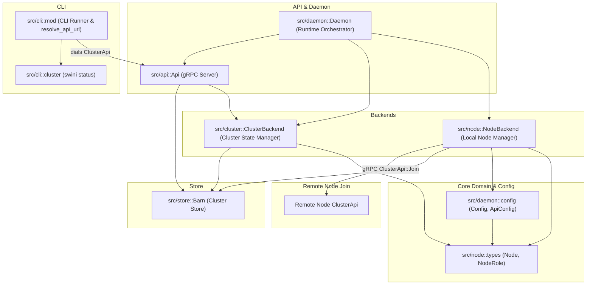

# [Plan] Multi-Node Cluster Joining and Membership

This plan implements node cluster joining, role-aware membership management, and
cluster status inspection. A layered architecture is introduced where
`NodeBackend` (in `src/node/mod.rs`) manages the local node's identity and
initiates the client-side join workflow, while `ClusterBackend` (in
`src/cluster/mod.rs`) manages cluster-wide membership, consensus expansion in
the Barn store, and the cluster node registry. Node entities (`Node` and
`NodeRole`) are defined in `src/node/types.rs`, and daemon configurations
(`Config`, `ApiConfig`) live in `src/daemon/config.rs`. The default API port is
set to `7440`. The dependency graph is strictly acyclic. Communication between
nodes is handled via a new `ClusterApi` gRPC service defined in
`proto/cluster.proto`, returning Swini `Node` representations with `is_primary`
status, and operators can inspect cluster topology using `swini status` with
smart multi-daemon API URL resolution via `resolve_api_url`. See
[goal.md](./goal.md) for the product requirements this design satisfies.

## Architecture



### Module Breakdown:

- **`src/node/types.rs`**: Houses `Node` and `NodeRole` entities (with
  `joined_at: String` timestamp).
- **`src/daemon/config.rs`**: Houses daemon configuration (`Config`) and API
  server configuration (`ApiConfig`), defaulting API port to `7440`.
- **`src/node/mod.rs`**: Houses `NodeBackend`, which manages the local node's
  lifecycle, node ID resolution/persistence, and triggers peer joining with
  automatic fallback across `join_addresses` on boot.
- **`src/cluster/mod.rs`**: Houses `ClusterBackend`, which operates on the
  `node/` prefix slice of the Barn store. It processes join requests (promoting
  `Server` nodes in Raft consensus and saving `Node` state) and serves cluster
  status queries.
- **`proto/cluster.proto` & `src/core/proto/cluster.rs`**: Defines the
  `ClusterApi` gRPC service contract (`Join` and `Status` RPCs) and the shared
  protobuf `Node` message with `is_primary`.
- **`src/api/cluster.rs`**: Implements `ClusterApiHandler` with request
  validation (`TryFrom<JoinReq> for Node`) and shared protobuf node mapping
  helpers, delegating RPC invocations to `ClusterBackend`.
- **`src/cli/mod.rs` & `src/cli/cluster.rs`**: `src/cli/mod.rs` implements
  `resolve_api_url(daemon_name_or_id)` to dynamically discover the active
  daemon's API address from environment variables or active daemon state,
  connects to `ClusterApiClient`, and delegates to `src/cli/cluster.rs` for
  rendering `swini status`.

---

## Implementation Details

### 1. `src/node/types.rs` — Node State & Roles

Domain representations of a Swini node and its assigned roles.

```rust
use serde::{Deserialize, Serialize};

/// This represents the multiple roles a swini node can have.
#[derive(Debug, Clone, Serialize, Deserialize, PartialEq, Eq)]
pub enum NodeRole {
  Server,
  Worker,
}

impl Default for NodeRole {
  fn default() -> Self {
    Self::Worker
  }
}

/// This represents a node (the node state) in the cluster.
#[derive(Debug, Clone, Serialize, Deserialize, Default)]
pub struct Node {
  pub id: u64,
  pub name: String,
  pub tags: Vec<String>,
  pub cpu_total: u32,
  pub memory_total: u32,
  pub cpu_reserved: u32,
  pub memory_reserved: u32,
  pub yardable_cpu: u32,
  pub yardable_memory: u32,
  pub running_piglets: Vec<String>,
  pub roles: Vec<NodeRole>,
  pub api_addr: String,
  /// ISO 8601 / RFC 3339 timestamp when the node joined the cluster.
  pub joined_at: String,
}
```

---

### 2. `src/daemon/config.rs` — Daemon & API Configuration

Configuration types specifying network bindings and cluster join addresses.
Defaults API port to `7440`.

```rust
use crate::node::NodeRole;
use serde::{Deserialize, Serialize};
use std::net::SocketAddr;
use std::path::PathBuf;

pub const DEFAULT_API_PORT: u16 = 7440;

/// API server configuration.
#[derive(Debug, Clone, Serialize, Deserialize)]
pub struct ApiConfig {
  /// Local socket address the gRPC server binds to.
  pub bind_address: SocketAddr,
}

impl Default for ApiConfig {
  fn default() -> Self {
    Self {
      bind_address: SocketAddr::from(([127, 0, 0, 1], DEFAULT_API_PORT)),
    }
  }
}

/// Configuration passed to a Swini daemon on startup.
#[derive(Debug, Clone, Serialize, Deserialize)]
pub struct Config {
  /// Optional human-readable daemon name (also used as node name).
  pub name: Option<String>,
  /// API configuration for gRPC listener and peer reachability.
  pub api: ApiConfig,
  /// Directory for persistent storage (Barn DB, raft logs, node identity).
  pub data_dir: PathBuf,
  /// The roles this node fulfills (Server, Worker, or both).
  pub roles: Vec<NodeRole>,
  /// Custom tags assigned to this node.
  pub tags: Vec<String>,
  /// List of peer API addresses to join on boot.
  pub join_addresses: Vec<String>,
}
```

---

### 3. `src/node/mod.rs` — Local Node Backend

Manages local node identity, deterministically generating and persisting
`node_id`, and handling the client-side join workflow with peer fallback.

```rust
mod types;

pub use types::*;

use crate::daemon::Config;
use crate::store::barn::{Barn, Node as BarnNode};
use std::error::Error;
use std::sync::Arc;
use tokio::sync::RwLock;

pub struct NodeBackend {
  config: Config,
  self_node: Arc<RwLock<Node>>,
  barn: Arc<Barn>,
}

impl NodeBackend {
  /// Spawns the NodeBackend, generating/persisting the local node ID and initializing self state.
  pub async fn spawn(config: Config, barn: Arc<Barn>) -> Result<Self, Box<dyn Error>> {
    let node_id = Self::provide_node_id(&config.data_dir)?;
    let name = config.name.clone().unwrap_or_else(|| format!("node-{}", node_id));

    let self_node = Node {
      id: node_id,
      name,
      tags: config.tags.clone(),
      roles: config.roles.clone(),
      api_addr: config.api.bind_address.to_string(),
      joined_at: String::new(),
      ..Default::default()
    };

    Ok(Self {
      config,
      self_node: Arc::new(RwLock::new(self_node)),
      barn,
    })
  }

  /// Initiates join against configured peer addresses, trying each address sequentially
  /// and failing over to the next if connection fails.
  pub async fn join(&self) -> Result<(), Box<dyn Error>> {
    if self.config.join_addresses.is_empty() {
      return Ok(());
    }

    let node = self.self_node.read().await.clone();
    for peer in &self.config.join_addresses {
      if let Ok(server_nodes) = self.dial_join(peer, &node).await {
        // For worker nodes, populate the Barn node cache with the received server nodes
        if !node.roles.contains(&NodeRole::Server) {
          let barn_nodes: Vec<BarnNode> = server_nodes
            .into_iter()
            .map(|n| BarnNode::new(n.id, n.api_addr))
            .collect();
          self.barn.node_cache_set(barn_nodes).await?;
        }
        return Ok(());
      }
    }

    Err("Failed to join cluster from any configured peer address".into())
  }

  /// Helper to persist or retrieve the deterministic node ID from disk (data_dir/node.id).
  fn provide_node_id(data_dir: &std::path::Path) -> Result<u64, Box<dyn Error>> {
    let id_file = data_dir.join("node.id");
    if id_file.exists() {
      let content = std::fs::read_to_string(&id_file)?;
      let id = content.trim().parse::<u64>()?;
      return Ok(id);
    }

    let id = rand::random::<u32>() as u64;
    std::fs::create_dir_all(data_dir)?;
    std::fs::write(&id_file, id.to_string())?;
    Ok(id)
  }
}
```

---

### 4. `src/cluster/mod.rs` — Cluster Backend

Manages cluster-wide membership, processes incoming join RPCs, and serves
cluster status.

```rust
use crate::node::{Node, NodeRole};
use crate::store::barn::{Barn, Node as BarnNode};
use crate::store::{ItemStore, SpreadStore};
use std::error::Error;
use std::sync::Arc;

pub struct ClusterBackend {
  barn: Arc<Barn>,
  node_store: Barn, // barn.slice("node/")
}

impl ClusterBackend {
  /// Creates the ClusterBackend wrapping the node slice of the Barn.
  pub fn new(barn: Arc<Barn>) -> Self {
    let node_store = barn.slice("node/");
    Self { barn, node_store }
  }

  /// Registers a joining node into the cluster, stamping joined_at, and returns all server nodes.
  pub async fn join(&self, mut node: Node) -> Result<Vec<Node>, Box<dyn Error>> {
    // 1. If joining node has Server role, add to Barn Raft membership
    if node.roles.contains(&NodeRole::Server) {
      let barn_node = BarnNode::new(node.id, node.api_addr.clone());
      self.barn.node_add(barn_node).await?;
    }

    // 2. Set authoritative join timestamp
    node.joined_at = chrono::Utc::now().to_rfc3339();

    // 3. Persist the full node record into Barn under "node/{node_id}"
    let payload = serde_json::to_vec(&node)?;
    self.node_store.set(&node.id.to_string(), payload).await?;

    // 4. Return the list of all registered Server nodes (for worker node routing cache)
    let all_nodes = self.status().await?;
    let server_nodes = all_nodes
      .into_iter()
      .filter(|n| n.roles.contains(&NodeRole::Server))
      .collect();
    Ok(server_nodes)
  }

  /// Queries all registered nodes from the cluster store.
  pub async fn status(&self) -> Result<Vec<Node>, Box<dyn Error>> {
    let records = self.node_store.list(None).await?;
    let mut nodes = Vec::new();
    for (_, value) in records {
      let node: Node = serde_json::from_slice(&value)?;
      nodes.push(node);
    }
    Ok(nodes)
  }

  /// Returns the node ID of the current cluster primary (Barn Raft leader).
  pub async fn primary_node_id(&self) -> Option<u64> {
    self.barn.node_list().await.ok().and_then(|nodes| {
      nodes.into_iter().find(|n| n.is_leader).map(|n| n.id)
    })
  }
}
```

---

### 5. `proto/cluster.proto` & gRPC Code Generation

Defines the gRPC contract for cluster membership and status.

```protobuf
syntax = "proto3";

package swini.cluster;

service ClusterApi {
  rpc Join(JoinReq) returns (JoinRes);
  rpc Status(StatusReq) returns (StatusRes);
}

message JoinReq {
  uint64 id = 1;
  string name = 2;
  string api_addr = 3;
  repeated string roles = 4;
  repeated string tags = 5;
}

message JoinRes {
  repeated Node server_nodes = 1;
}

message StatusReq {}

message StatusRes {
  repeated Node nodes = 1;
  uint64 primary_id = 2;
}

message Node {
  uint64 id = 1;
  string name = 2;
  string api_addr = 3;
  repeated string roles = 4;
  repeated string tags = 5;
  string joined_at = 6;
  bool is_primary = 7;
}
```

---

### 6. `src/api/cluster.rs` & `src/api/mod.rs` — API Handlers

Exposes `ClusterApiHandler`, request conversion/validation via
`TryFrom<JoinReq>`, and node-to-proto mapping helpers.

```rust
use crate::cluster::ClusterBackend;
use crate::core::proto::cluster::cluster::cluster_api_server::{ClusterApi, ClusterApiServer};
use crate::core::proto::cluster::cluster::{JoinReq, JoinRes, Node as ProtoNode, StatusReq, StatusRes};
use crate::node::{Node, NodeRole};
use crate::store::barn::Barn;
use std::sync::Arc;
use tonic::{Request, Response, Status};

impl TryFrom<JoinReq> for Node {
  type Error = Status;

  fn try_from(req: JoinReq) -> Result<Self, Self::Error> {
    if req.id == 0 {
      return Err(Status::invalid_argument("node id must be greater than 0"));
    }
    if req.api_addr.trim().is_empty() {
      return Err(Status::invalid_argument("api_addr cannot be empty"));
    }
    let roles = req.roles.into_iter().map(|r| match r.to_lowercase().as_str() {
      "server" => Ok(NodeRole::Server),
      "worker" => Ok(NodeRole::Worker),
      other => Err(Status::invalid_argument(format!("unknown role: {other}"))),
    }).collect::<Result<Vec<_>, _>>()?;

    if roles.is_empty() {
      return Err(Status::invalid_argument("node must specify at least one role"));
    }

    Ok(Node {
      id: req.id,
      name: if req.name.is_empty() { format!("node-{}", req.id) } else { req.name },
      tags: req.tags,
      roles,
      api_addr: req.api_addr,
      joined_at: String::new(),
      ..Default::default()
    })
  }
}

/// Converts a domain `Node` into its protobuf representation.
fn to_proto_node(node: Node, primary_id: Option<u64>) -> ProtoNode {
  ProtoNode {
    id: node.id,
    name: node.name,
    api_addr: node.api_addr,
    roles: node.roles.into_iter().map(|r| format!("{:?}", r).to_lowercase()).collect(),
    tags: node.tags,
    joined_at: node.joined_at,
    is_primary: Some(node.id) == primary_id,
  }
}

/// Maps a vector of domain `Node`s to protobuf `Node`s.
fn to_proto_nodes(nodes: Vec<Node>, primary_id: Option<u64>) -> Vec<ProtoNode> {
  nodes.into_iter().map(|n| to_proto_node(n, primary_id)).collect()
}

fn to_status<E: std::fmt::Display>(err: E) -> Status {
  Status::internal(err.to_string())
}

#[derive(Clone)]
pub struct ClusterApiHandler {
  cluster: ClusterBackend,
}

impl ClusterApiHandler {
  pub fn new(barn: Arc<Barn>) -> Self {
    Self {
      cluster: ClusterBackend::new(barn),
    }
  }
}

#[tonic::async_trait]
impl ClusterApi for ClusterApiHandler {
  async fn join(&self, request: Request<JoinReq>) -> Result<Response<JoinRes>, Status> {
    let node: Node = request.into_inner().try_into()?;
    let server_nodes = self.cluster.join(node).await.map_err(to_status)?;
    let primary_id = self.cluster.primary_node_id().await;

    Ok(Response::new(JoinRes {
      server_nodes: to_proto_nodes(server_nodes, primary_id),
    }))
  }

  async fn status(&self, _request: Request<StatusReq>) -> Result<Response<StatusRes>, Status> {
    let nodes = self.cluster.status().await
      .map_err(to_status)?;
    let primary_id = self.cluster.primary_node_id().await;

    Ok(Response::new(StatusRes {
      nodes: to_proto_nodes(nodes, primary_id),
      primary_id: primary_id.unwrap_or(0),
    }))
  }
}
```

---

### 7. `src/cli/mod.rs` & `src/cli/cluster.rs` — CLI Commands & URL Resolution

`src/cli/mod.rs` resolves the active daemon API URL (supporting multi-daemon
metadata discovery) and passes the connected client to commands:

```rust
// src/cli/mod.rs
use clap::{Parser, Subcommand};
use std::error::Error;
use crate::core::proto::cluster::cluster::cluster_api_client::ClusterApiClient;
use crate::daemon::DEFAULT_API_PORT;

mod daemon;
mod cluster;

#[derive(Parser, Debug)]
#[command(author, version, about = "Swini Command Line Interface")]
struct Cli {
  #[command(subcommand)]
  pub command: Command,
}

#[derive(Subcommand, Debug)]
enum Command {
  Daemon {
    #[command(subcommand)]
    command: daemon::Command,
  },
  /// Inspect cluster status and registered nodes
  Status,
}

/// Resolves the daemon API URL:
/// 1. From SWINI_API_URL environment variable if set.
/// 2. By inspecting active daemon metadata in data_dir/daemons/<name_or_id>/daemon.json.
/// 3. Falling back to default `http://127.0.0.1:7440`.
pub fn resolve_api_url(daemon_name_or_id: Option<&str>) -> Result<String, Box<dyn Error>> {
  if let Ok(url) = std::env::var("SWINI_API_URL") {
    return Ok(url);
  }

  if let Ok(data_dir) = std::env::var("SWINI_DATA_DIR") {
    let daemons_dir = std::path::PathBuf::from(data_dir).join("daemons");
    if daemons_dir.exists() {
      // Find matching or active daemon metadata and return its api address
    }
  }

  Ok(format!("http://127.0.0.1:{}", DEFAULT_API_PORT))
}

pub async fn run() -> Result<(), Box<dyn Error>> {
  let cli = Cli::parse();

  match cli.command {
    Command::Daemon { command } => daemon::run(command).await,
    Command::Status => {
      let url = resolve_api_url(None)?;
      let channel = tonic::transport::Endpoint::from_shared(url)?
        .connect()
        .await?;
      let client = ClusterApiClient::new(channel);
      cluster::status(client).await
    }
  }
}
```

`src/cli/cluster.rs` prints the formatted status table:

```rust
// src/cli/cluster.rs
use crate::core::proto::cluster::cluster::cluster_api_client::ClusterApiClient;
use crate::core::proto::cluster::cluster::StatusReq;
use std::error::Error;
use tonic::transport::Channel;

pub async fn status(mut client: ClusterApiClient<Channel>) -> Result<(), Box<dyn Error>> {
  let res = client.status(StatusReq {}).await?.into_inner();

  println!("{:<8} {:<20} {:<15} {:<25} {:<10}", "ID", "NAME", "ROLE", "JOINED AT", "PRIMARY");
  for node in res.nodes {
    let roles = node.roles.join(",");
    let is_primary = if node.is_primary { "yes" } else { "no" };
    println!("{:<8} {:<20} {:<15} {:<25} {:<10}", node.id, node.name, roles, node.joined_at, is_primary);
  }
  Ok(())
}
```

---

## Data Model / API Changes

- **`Node` & `NodeRole` in `src/node/types.rs`**:
  - Maintained in `src/node/types.rs` and re-exported from `src/node/mod.rs`.
  - Added `pub joined_at: String` (RFC 3339 formatted timestamp).
- **`daemon::Config` & `daemon::ApiConfig` in `src/daemon/config.rs`**:
  - Exposes `Config` (`pub name: Option<String>`) and `ApiConfig` with explicit
    `bind_address`. Default port is `7440`.
- **Protobuf Schema (`proto/cluster.proto`)**:
  - Introduces `ClusterApi` service with `Join` and `Status` methods.
  - Defines `Node` proto message with `is_primary` boolean field and
    `primary_id` in `StatusRes`.
- **`Api` Server (`src/api/mod.rs`)**:
  - `Api::new` accepts `Arc<Barn>`, constructing both `BarnApiHandler` and
    `ClusterApiHandler` and registering both `BarnApiServer` and
    `ClusterApiServer`.
- **`Cli` Interface (`src/cli/mod.rs`)**:
  - Added top-level `Status` command and `resolve_api_url(daemon_name_or_id)`
    helper supporting multi-daemon configurations and defaulting to
    `http://127.0.0.1:7440`.

---

## Testing Strategy

- **Unit Tests**:
  - `src/node/mod.rs`: Node ID generation, persistence in data directory,
    self-node initialization with `ApiConfig::bind_address`, and sequential
    failover testing across `join_addresses`.
  - `src/cluster/mod.rs`:
    - Handling `Server` node join (verifies `Barn::node_add` call, `joined_at`
      timestamp assignment, and `node/{id}` key insertion).
    - Handling `Worker` node join (verifies no `Barn::node_add` call, but
      `node/{id}` key is written with `joined_at`).
    - `status()` retrieval reading and deserializing all `node/*` entries.
    - `primary_node_id()` checking.
  - `src/api/cluster.rs`:
    - `TryFrom<JoinReq> for Node` validation testing (invalid ID 0, empty
      `api_addr`, invalid role strings, empty roles).
    - `to_proto_nodes` conversion and `is_primary` assignment testing.
  - `src/cli/mod.rs`:
    - `resolve_api_url()` testing under default (`7440`), environment variable
      override, and daemon state directory lookup.
- **Integration Tests**:
  - Spinning up two memory/tempfile Barn instances (Node 1 as Server, Node 2
    joining Node 1).
  - Verifying Node 2 joins successfully, Barn membership expands, and `status()`
    returns both nodes with primary flagged.
  - Verifying a Worker node joining returns server node topology (`Vec<Node>`)
    and updates worker Barn cache.
- **E2E / CLI Tests**:
  - Executing `swini status` via `assert_cmd` against a running test server and
    verifying table output formatting.

---

## Risks & Open Questions

- **Raft Voter Quorum Expansion**: Adding voters sequentially requires a live
  quorum among existing voters. Multi-node bootstrapping must ensure the initial
  seed server is running before additional server nodes join.
- **Worker Node Failover**: If a worker node's cached primary server becomes
  unreachable, it will need to fall back to other server nodes discovered during
  join.

---

## Out of Scope

- Dynamic hardware resource probing (CPU/Memory usage sampling).
- Automatic mDNS or gossip-based peer discovery.
- Workload scheduling and Piglet lifecycle execution.
