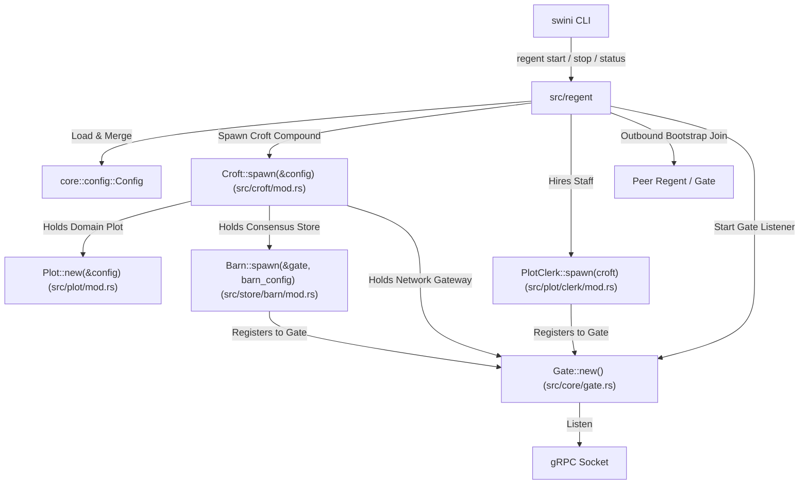

# [Plan] Regent Lifecycle Management

This plan details the technical implementation for Swini **Regent** lifecycle
management, introducing scoped CLI commands (`swini regent start`,
`swini regent stop`, and `swini regent status`). The architecture establishes a
dedicated `regent` module for host process supervision (running in the
foreground by default, with an optional `--detached` / `-d` flag for background
daemon execution), hierarchical configuration loading and merging (with YAML
support), multi-instance isolation under `~/.swini/regents/{name}`, daily
rolling file telemetry with `SWINI_LOG_LEVEL` filtering, a physical operational
compound **Croft** in `src/croft/mod.rs` (holding `Plot`, `Barn`, `Gate`, and
`Config`), a domain-driven **Plot** module in `src/plot/` (`types.rs`,
`clerk/mod.rs`, `clerk/api.rs`), self-contained gRPC transport in
`src/store/barn/api.rs`, and a clean **Gate** network host in `src/core/gate.rs`
with thread-safe interior mutability (`add(&self, svc)`). See
[goal.md](./goal.md) for the product requirements this design satisfies.

## Architecture

The lifecycle architecture coordinates configuration resolution, process
supervision, telemetry, and delegates API hosting to `src/core/gate.rs`:



### Key Architectural Decisions

1. **Scoped CLI & `regent` Module**:
   - `src/regent/` encapsulates all host process lifecycle logic: process
     supervision, signal trapping, `state.json` persistence, telemetry
     configuration, and orchestrating the Croft compound and staff workers.
   - CLI exposes scoped subcommands under `regent`: `swini regent start`,
     `swini regent stop`, `swini regent status`.
   - `swini regent start` runs attached in the foreground by default. Passing
     `--detached` / `-d` forks the process into the background.

2. **Croft Operational Compound (`src/croft/mod.rs`)**:
   - Encapsulates the physical operational compound on a single machine:
     - `pub plot: Plot`: Domain identity and metadata.
     - `pub barn: Arc<Barn>`: Consensus storage engine.
     - `pub gate: Gate`: Network gRPC router and listener.
     - `pub config: Config`: Active runtime configuration.

3. **Domain-Driven Plot Module (`src/plot/`)**:
   - Encapsulates all domain types, clerk staff operations, and gRPC endpoints
     for machine/parcel identity:
     - `src/plot/mod.rs`: Domain entities (`Plot`, `PlotRole`) and constructor
       `Plot::new(&config)` providing persistent `plot.id`.
     - `src/plot/clerk/mod.rs`: `plot::Clerk` staff worker holding `Arc<Croft>`,
       spawned via `PlotClerk::spawn(croft)` which registers `plot.api()` to
       `croft.gate.add(...)`.
     - `src/plot/clerk/api.rs`: gRPC handler (`plot::Api`) implementing
       `PlotApi`.

4. **Self-Contained Barn Transport (`src/store/barn/api.rs`) & Flattened Pure
   BarnConfig**:
   - Barn owns its own gRPC service handler in `src/store/barn/api.rs`, mounting
     its service directly onto `Gate` during `Barn::spawn(&gate, config)`.
   - Barn configuration is a pure struct with flattened fields (`id`, `addr`,
     `data_dir`, `heartbeat_interval`, `election_timeout_min`,
     `election_timeout_max`).

5. **Gate Network Gateway (`src/croft/gate.rs`)**:
   - The **Gate** is the unified network gateway that owns the gRPC server and
     router.
   - Built with thread-safe interior mutability
     (`Arc<Mutex<Option<GateState>>>`), exposing
     `pub fn add<S, B>(&self, svc: S)` and
     `pub async fn listen(&self, addr: SocketAddr)`.

6. **Configuration Hierarchy & Resolution**: `Config::load(path: Option<&Path>)`
   implements a layered configuration resolver:
   - Base defaults: name `"main"`, port `7440`, data directory
     `~/.swini/regents/main`, roles `[Server, Worker]`.
   - File override: If `path` is provided, load and parse YAML from `path`. If
     `path` is `None`, look for `./swini.yml` in the current working directory.
   - Environment variables: `SWINI_ADDR`, `SWINI_DATA_DIR`, `SWINI_LOG_LEVEL`.
   - Path expansion: Base directory `~/.swini/regents/{name}/` containing
     `state.json`, `logs/`, and `data/`.

7. **Process Supervision & Lifecycle State**:
   - Foreground execution is default. When `--detached` / `-d` is passed,
     `daemonize::Daemonize` is used to fork into a background daemon before
     starting async workers.
   - Regent state is written to `~/.swini/regents/{name}/state.json` containing
     the PID, socket address, start timestamp, and active configuration
     snapshot.
   - `regent::stop` reads `state.json`, verifies process liveness
     (`kill -0 <pid>`), sends `SIGTERM`, waits for process exit, and removes
     `state.json`.
   - `regent::status` scans `~/.swini/regents/` and inspects `state.json` across
     all local Regent instances.

8. **Telemetry & Log Rotation**:
   - `core::telemetry::init` configures a `tracing-subscriber` registry with a
     non-blocking daily rolling file appender
     (`tracing-appender::rolling::daily`), outputting to
     `{data_dir}/logs/regent.log`.
   - Console logging layer is enabled when running in foreground (default) and
     disabled when `--detached` is specified.
   - Log level defaults to `"info,openraft=warn"`, customizable via
     `SWINI_LOG_LEVEL` or `RUST_LOG`.

---

## Implementation Details

### 1. `proto/plot.proto` & `src/core/proto/plot.rs` — Plot Protocol Definition

```protobuf
syntax = "proto3";

package swini.plot;

service PlotApi {
  rpc Join(JoinReq) returns (JoinRes);
  rpc Status(StatusReq) returns (StatusRes);
}

message JoinReq {
  uint64 id = 1;
  string name = 2;
  string addr = 3;
  repeated string roles = 4;
  repeated string tags = 5;
}

message JoinRes {
  repeated Plot server_plots = 1;
}

message StatusReq {}

message StatusRes {
  repeated Plot plots = 1;
  uint64 primary_id = 2;
}

message Plot {
  uint64 id = 1;
  string name = 2;
  string addr = 3;
  repeated string roles = 4;
  repeated string tags = 5;
  string joined_at = 6;
  bool is_primary = 7;
}
```

In `src/core/proto/plot.rs`:

```rust
tonic::include_proto!("swini.plot");
```

---

### 2. `src/core/entities.rs` — Pure Domain Entities

```rust
use serde::{Deserialize, Serialize};

#[derive(Debug, Clone, Copy, PartialEq, Eq, Serialize, Deserialize)]
#[serde(rename_all = "lowercase")]
pub enum PlotRole {
  Server,
  Worker,
}

impl std::str::FromStr for PlotRole {
  type Err = String;
  fn from_str(s: &str) -> Result<Self, Self::Err> {
    match s.to_lowercase().as_str() {
      "server" => Ok(Self::Server),
      "worker" => Ok(Self::Worker),
      other => Err(format!("Unknown plot role: {}", other)),
    }
  }
}

/// Pure data entity representing a Plot (machine/host) in the Ranch.
#[derive(Debug, Clone, Serialize, Deserialize, PartialEq, Eq, Default)]
pub struct Plot {
  pub id: u64,
  pub name: String,
  pub addr: String,
  pub roles: Vec<PlotRole>,
  pub tags: Vec<String>,
  pub joined_at: String,
}
```

---

### 3. `src/clerk/plot/mod.rs` & `src/clerk/plot/api.rs` — PlotClerk & gRPC Handler

```rust
// In src/clerk/plot/mod.rs
pub mod api;

pub use api::PlotApiHandler;

use crate::core::config::Config;
use crate::core::entities::{Plot, PlotRole};
use crate::store::barn::{Barn, Node as BarnNode};
use crate::store::{ItemStore, SpreadNode, SpreadStore};
use std::error::Error;
use std::path::Path;
use std::sync::Arc;
use tokio::sync::RwLock;

#[derive(Clone)]
pub struct PlotClerk {
  local: Arc<RwLock<Plot>>,
  barn: Arc<Barn>,
  store: Barn,
}

impl PlotClerk {
  pub fn new(config: &Config, barn: Arc<Barn>) -> Result<Self, Box<dyn Error>> {
    let plot_id = Self::id_provide(&config.data_dir)?;
    let local = Plot {
      id: plot_id,
      name: config.name.clone(),
      addr: config.addr.to_string(),
      roles: config.roles.clone(),
      tags: config.tags.clone(),
      joined_at: String::new(),
    };
    let store = barn.slice("plot/");
    Ok(Self {
      local: Arc::new(RwLock::new(local)),
      barn,
      store,
    })
  }

  /// Generates or loads a stable plot ID from the given data directory.
  pub fn id_provide(data_dir: &Path) -> Result<u64, Box<dyn Error>> {
    let id_file = data_dir.join("plot.id");
    if id_file.exists() {
      let content = std::fs::read_to_string(&id_file)?;
      let id = content.trim().parse::<u64>()?;
      return Ok(id);
    }

    let id = rand::random::<u32>() as u64;
    std::fs::create_dir_all(data_dir)?;
    std::fs::write(&id_file, id.to_string())?;
    Ok(id)
  }

  /// Returns the local Plot identity.
  pub async fn local(&self) -> Plot {
    self.local.read().await.clone()
  }

  /// Retrieves a plot by ID (returns local if matching, otherwise queries Barn).
  pub async fn get(&self, plot_id: u64) -> Result<Option<Plot>, Box<dyn Error>> {
    let local = self.local().await;
    if local.id == plot_id {
      return Ok(Some(local));
    }

    if let Some(bytes) = self.store.get(&plot_id.to_string()).await? {
      let plot: Plot = serde_json::from_slice(&bytes)?;
      return Ok(Some(plot));
    }

    Ok(None)
  }

  /// Lists all registered Plots across the Ranch.
  pub async fn list(&self) -> Result<Vec<Plot>, Box<dyn Error>> {
    let records = self.store.list(None).await?;
    let mut plots = Vec::new();
    for (_, value) in records {
      let plot: Plot = serde_json::from_slice(&value)?;
      plots.push(plot);
    }
    Ok(plots)
  }

  /// Joins an incoming Plot: updates Barn Raft membership if server, stamps joined_at, and saves record.
  pub async fn join(&self, mut incoming: Plot) -> Result<Vec<Plot>, Box<dyn Error>> {
    if incoming.roles.contains(&PlotRole::Server) {
      let barn_node = BarnNode::new(incoming.id, incoming.addr.clone());
      self.barn.node_add(barn_node).await?;
    }

    incoming.joined_at = chrono::Utc::now().to_rfc3339();
    let payload = serde_json::to_vec(&incoming)?;
    self.store.set(&incoming.id.to_string(), payload).await?;

    let records = self.store.list(None).await?;
    let mut server_plots = Vec::new();
    for (_, value) in records {
      let plot: Plot = serde_json::from_slice(&value)?;
      if plot.roles.contains(&PlotRole::Server) {
        server_plots.push(plot);
      }
    }

    Ok(server_plots)
  }
}
```

```rust
// In src/clerk/plot/api.rs
use crate::clerk::plot::PlotClerk;
use crate::core::entities::{Plot, PlotRole};
use crate::core::proto::plot::plot_api_server::PlotApi;
use crate::core::proto::plot::{JoinReq, JoinRes, Plot as ProtoPlot, StatusReq, StatusRes};
use tonic::{Request, Response, Status};

pub fn plot_from_join_req(req: JoinReq) -> Result<Plot, String> {
  if req.name.trim().is_empty() {
    return Err("Plot name cannot be empty".to_string());
  }
  if req.addr.trim().is_empty() {
    return Err("Plot address cannot be empty".to_string());
  }

  let mut roles = Vec::new();
  for r in req.roles {
    roles.push(r.parse::<PlotRole>()?);
  }
  if roles.is_empty() {
    roles.push(PlotRole::Worker);
  }

  Ok(Plot {
    id: req.id,
    name: req.name.trim().to_string(),
    addr: req.addr.trim().to_string(),
    roles,
    tags: req.tags,
    joined_at: String::new(),
  })
}

pub fn proto_plot_from_plot(plot: Plot) -> ProtoPlot {
  ProtoPlot {
    id: plot.id,
    name: plot.name,
    addr: plot.addr,
    roles: plot.roles.into_iter().map(|r| format!("{:?}", r).to_lowercase()).collect(),
    tags: plot.tags,
    joined_at: plot.joined_at,
    is_primary: false,
  }
}

#[derive(Clone)]
pub struct PlotApiHandler {
  clerk: PlotClerk,
}

impl PlotApiHandler {
  pub fn new(clerk: PlotClerk) -> Self {
    Self { clerk }
  }
}

#[tonic::async_trait]
impl PlotApi for PlotApiHandler {
  async fn join(&self, request: Request<JoinReq>) -> Result<Response<JoinRes>, Status> {
    let incoming = plot_from_join_req(request.into_inner())
      .map_err(|e| Status::invalid_argument(e))?;

    let server_plots = self.clerk.join(incoming).await
      .map_err(|e| Status::internal(e.to_string()))?;

    let proto_servers = server_plots.into_iter().map(proto_plot_from_plot).collect();
    Ok(Response::new(JoinRes { server_plots: proto_servers }))
  }

  async fn status(&self, _request: Request<StatusReq>) -> Result<Response<StatusRes>, Status> {
    let plots = self.clerk.list().await
      .map_err(|e| Status::internal(e.to_string()))?;

    let proto_plots = plots.into_iter().map(proto_plot_from_plot).collect();
    Ok(Response::new(StatusRes {
      plots: proto_plots,
      primary_id: 0,
    }))
  }
}
```

---

### 4. `src/clerk/barn/mod.rs` & `src/clerk/barn/api.rs` — BarnClerk & API Handler

```rust
// In src/clerk/barn/mod.rs
pub mod api;

pub use api::BarnApiHandler;

use crate::store::barn::Barn;
use std::sync::Arc;

#[derive(Clone)]
pub struct BarnClerk {
  barn: Arc<Barn>,
}

impl BarnClerk {
  pub fn new(barn: Arc<Barn>) -> Self {
    Self { barn }
  }

  pub fn barn(&self) -> &Arc<Barn> {
    &self.barn
  }
}
```

```rust
// In src/clerk/barn/api.rs
use crate::clerk::barn::BarnClerk;
use crate::core::proto::barn::barn_api_server::BarnApi;
use crate::core::proto::barn::{
  AppendEntriesReq, AppendEntriesRes, ForwardReadReq, ForwardReadRes, ForwardWriteReq,
  ForwardWriteRes, InstallSnapshotReq, InstallSnapshotRes, NodeAddReq, NodeAddRes, VoteReq,
  VoteRes,
};
use crate::store::barn::Node as BarnNode;
use crate::store::SpreadNode;
use tonic::{Request, Response, Status};

#[derive(Clone)]
pub struct BarnApiHandler {
  clerk: BarnClerk,
}

impl BarnApiHandler {
  pub fn new(clerk: BarnClerk) -> Self {
    Self { clerk }
  }
}

#[tonic::async_trait]
impl BarnApi for BarnApiHandler {
  async fn append_entries(&self, req: Request<AppendEntriesReq>) -> Result<Response<AppendEntriesRes>, Status> {
    // Barn Raft RPC dispatch
    Err(Status::unimplemented("append_entries"))
  }

  async fn vote(&self, req: Request<VoteReq>) -> Result<Response<VoteRes>, Status> {
    Err(Status::unimplemented("vote"))
  }

  async fn install_snapshot(&self, req: Request<InstallSnapshotReq>) -> Result<Response<InstallSnapshotRes>, Status> {
    Err(Status::unimplemented("install_snapshot"))
  }

  async fn forward_write(&self, req: Request<ForwardWriteReq>) -> Result<Response<ForwardWriteRes>, Status> {
    Err(Status::unimplemented("forward_write"))
  }

  async fn forward_read(&self, req: Request<ForwardReadReq>) -> Result<Response<ForwardReadRes>, Status> {
    Err(Status::unimplemented("forward_read"))
  }

  async fn node_add(&self, req: Request<NodeAddReq>) -> Result<Response<NodeAddRes>, Status> {
    let inner = req.into_inner();
    let node = BarnNode::new(inner.id, inner.addr);
    self.clerk.barn().node_add(node).await
      .map_err(|e| Status::internal(e.to_string()))?;
    Ok(Response::new(NodeAddRes { success: true }))
  }
}
```

---

### 5. `src/clerk/mod.rs` — Central Clerk Front-Office

```rust
pub mod barn;
pub mod plot;

pub use barn::BarnClerk;
pub use plot::PlotClerk;

use crate::clerk::barn::BarnApiHandler;
use crate::clerk::plot::PlotApiHandler;
use crate::core::config::Config;
use crate::core::proto::barn::barn_api_server::BarnApiServer;
use crate::core::proto::plot::plot_api_server::PlotApiServer;
use crate::store::barn::Barn;
use std::error::Error;
use std::net::SocketAddr;
use std::sync::Arc;
use tonic::transport::server::Router;
use tonic::transport::Server;

pub struct Clerk {
  router: Option<Router>,
  pub plot: PlotClerk,
  pub barn: BarnClerk,
}

impl Clerk {
  /// Spawns the central Clerk, initializing PlotClerk and BarnClerk and registering all gRPC service handlers.
  pub async fn spawn(config: &Config, barn: Arc<Barn>) -> Result<Self, Box<dyn Error>> {
    let plot_clerk = PlotClerk::new(config, barn.clone())?;
    let plot_handler = PlotApiHandler::new(plot_clerk.clone());

    let barn_clerk = BarnClerk::new(barn.clone());
    let barn_handler = BarnApiHandler::new(barn_clerk.clone());

    let router = Server::builder()
      .add_service(PlotApiServer::new(plot_handler))
      .add_service(BarnApiServer::new(barn_handler));

    Ok(Self {
      router: Some(router),
      plot: plot_clerk,
      barn: barn_clerk,
    })
  }

  /// Starts listening on the configured socket address.
  pub async fn listen(mut self, addr: SocketAddr) -> Result<(), Box<dyn Error>> {
    if let Some(router) = self.router.take() {
      router.serve(addr).await?;
    }
    Ok(())
  }
}
```

---

### 6. `src/core/config.rs` — Configuration & Merging

```rust
use crate::core::entities::PlotRole;
use serde::{Deserialize, Serialize};
use std::net::SocketAddr;
use std::path::{Path, PathBuf};

pub const DEFAULT_ADDR: &str = "127.0.0.1:7440";
pub const DEFAULT_NAME: &str = "main";

#[derive(Debug, Clone, Serialize, Deserialize)]
pub struct Config {
  #[serde(default = "default_name")]
  pub name: String,
  #[serde(default = "default_addr")]
  pub addr: SocketAddr,
  #[serde(default)]
  pub data_dir: PathBuf,
  #[serde(default = "default_roles")]
  pub roles: Vec<PlotRole>,
  #[serde(default)]
  pub tags: Vec<String>,
  #[serde(default)]
  pub join_addresses: Vec<String>,
}

fn default_name() -> String {
  DEFAULT_NAME.to_string()
}

fn default_addr() -> SocketAddr {
  DEFAULT_ADDR.parse().unwrap()
}

fn default_roles() -> Vec<PlotRole> {
  vec![PlotRole::Server, PlotRole::Worker]
}

impl Default for Config {
  fn default() -> Self {
    let name = default_name();
    let data_dir = default_data_dir(&name);
    Self {
      name,
      addr: default_addr(),
      data_dir,
      roles: default_roles(),
      tags: Vec::new(),
      join_addresses: Vec::new(),
    }
  }
}

/// Computes root data directory for a Regent: `~/.swini/regents/{name}`.
pub fn default_data_dir(name: &str) -> PathBuf {
  let home = std::env::var("HOME").unwrap_or_else(|_| ".".to_string());
  PathBuf::from(home).join(".swini").join("regents").join(name)
}

impl Config {
  pub fn load(path: Option<&Path>) -> Result<Self, Box<dyn std::error::Error>> {
    let mut config = Self::default();

    let file_path = if let Some(p) = path {
      if !p.exists() {
        return Err(format!("Config file not found: {}", p.display()).into());
      }
      Some(p.to_path_buf())
    } else if Path::new("swini.yml").exists() {
      Some(PathBuf::from("swini.yml"))
    } else {
      None
    };

    if let Some(ref p) = file_path {
      let content = std::fs::read_to_string(p)?;
      let file_config: serde_yml::Value = serde_yml::from_str(&content)?;
      let default_value = serde_yml::to_value(&config)?;
      let merged_value = merge_yaml_values(default_value, file_config);
      config = serde_yml::from_value(merged_value)?;
    }

    if config.data_dir.as_os_str().is_empty() {
      config.data_dir = default_data_dir(&config.name);
    }

    if let Ok(addr_str) = std::env::var("SWINI_ADDR") {
      if let Ok(parsed) = addr_str.parse::<SocketAddr>() {
        config.addr = parsed;
      }
    }

    Ok(config)
  }
}

fn merge_yaml_values(base: serde_yml::Value, override_val: serde_yml::Value) -> serde_yml::Value {
  match (base, override_val) {
    (serde_yml::Value::Mapping(mut base_map), serde_yml::Value::Mapping(override_map)) => {
      for (k, v) in override_map {
        if let Some(existing) = base_map.remove(&k) {
          base_map.insert(k, merge_yaml_values(existing, v));
        } else {
          base_map.insert(k, v);
        }
      }
      serde_yml::Value::Mapping(base_map)
    }
    (_, override_val) => override_val,
  }
}
```

---

### 7. `src/regent/state.rs` — Regent State Persistence

```rust
use crate::core::config::Config;
use serde::{Deserialize, Serialize};
use std::path::{Path, PathBuf};

#[derive(Debug, Clone, Serialize, Deserialize)]
pub struct RegentState {
  pub pid: u32,
  pub detached: bool,
  pub started_at: String,
  pub config: Config,
}

impl RegentState {
  pub fn path(data_dir: &Path) -> PathBuf {
    data_dir.join("state.json")
  }

  pub fn save(&self) -> Result<(), Box<dyn std::error::Error>> {
    std::fs::create_dir_all(&self.config.data_dir)?;
    let state_path = Self::path(&self.config.data_dir);
    let json = serde_json::to_string_pretty(self)?;
    std::fs::write(state_path, json)?;
    Ok(())
  }

  pub fn load(data_dir: &Path) -> Result<Self, Box<dyn std::error::Error>> {
    let state_path = Self::path(data_dir);
    let content = std::fs::read_to_string(state_path)?;
    let state = serde_json::from_str(&content)?;
    Ok(state)
  }

  pub fn cleanup(data_dir: &Path) {
    let state_path = Self::path(data_dir);
    let _ = std::fs::remove_file(state_path);
  }

  pub fn is_alive(&self) -> bool {
    unsafe { libc::kill(self.pid as i32, 0) == 0 }
  }
}
```

---

### 8. `src/core/telemetry.rs` — Telemetry & Rolling Logs

```rust
use std::path::Path;
use tracing_appender::non_blocking::WorkerGuard;
use tracing_subscriber::layer::SubscriberExt;
use tracing_subscriber::util::SubscriberInitExt;
use tracing_subscriber::{fmt, EnvFilter, Layer};

pub struct TelemetryGuard {
  _file_guard: Option<WorkerGuard>,
}

pub fn init(
  console_enabled: bool,
  log_dir: Option<&Path>,
  log_prefix: Option<&str>,
) -> TelemetryGuard {
  let filter_str = std::env::var("SWINI_LOG_LEVEL")
    .or_else(|_| std::env::var("RUST_LOG"))
    .unwrap_or_else(|_| "info,openraft=warn".to_string());

  let env_filter = EnvFilter::new(filter_str);

  let mut file_guard = None;
  let file_layer = if let Some(dir) = log_dir {
    let _ = std::fs::create_dir_all(dir);
    let file_appender = tracing_appender::rolling::daily(dir, "regent.log");
    let (non_blocking, guard) = tracing_appender::non_blocking(file_appender);
    file_guard = Some(guard);

    Some(
      fmt::layer()
        .with_ansi(false)
        .with_writer(non_blocking)
        .with_target(true)
        .with_filter(EnvFilter::new("info,openraft=warn")),
    )
  } else {
    None
  };

  let console_layer = if console_enabled {
    Some(fmt::layer().with_ansi(true).with_target(false))
  } else {
    None
  };

  let _ = tracing_subscriber::registry()
    .with(env_filter)
    .with(file_layer)
    .with(console_layer)
    .try_init();

  TelemetryGuard {
    _file_guard: file_guard,
  }
}
```

---

### 9. `src/regent/mod.rs` — Regent Lifecycle Orchestration

```rust
pub mod state;

use crate::clerk::{Clerk, PlotClerk};
use crate::core::config::{self, Config, DEFAULT_ADDR, DEFAULT_NAME};
use crate::core::entities::Plot;
use crate::core::proto::plot::plot_api_client::PlotApiClient;
use crate::core::proto::plot::JoinReq;
use crate::core::telemetry;
use crate::store::barn::{Barn, Config as BarnConfig, Node as BarnNode, RaftConfig};
pub use state::RegentState;
use std::error::Error;
use std::path::{Path, PathBuf};
use std::sync::Arc;

pub async fn start(
  config_path: Option<PathBuf>,
  detached: bool,
) -> Result<(), Box<dyn Error>> {
  let config = Config::load(config_path.as_deref())?;

  if detached {
    let dev_null = std::fs::File::create("/dev/null")?;
    let daemonize = daemonize::Daemonize::new()
      .working_directory(std::env::current_dir().unwrap_or_else(|_| PathBuf::from("/")))
      .stdout(dev_null.try_clone()?)
      .stderr(dev_null);

    if let Err(e) = daemonize.start() {
      eprintln!("Failed to start regent in background: {}", e);
      std::process::exit(1);
    }
  }

  let log_dir = config.data_dir.join("logs");
  let _telemetry_guard = telemetry::init(!detached, Some(&log_dir), Some(&config.name));

  tracing::info!(name = %config.name, addr = %config.addr, "starting swini regent");

  let state = RegentState {
    pid: std::process::id(),
    detached,
    started_at: chrono::Utc::now().to_rfc3339(),
    config: config.clone(),
  };
  state.save()?;

  state.save()?;

  let croft = Arc::new(Croft::spawn(&config).await?);

  if !config.join_addresses.is_empty() {
    let _ = bootstrap_join(&croft).await;
  }

  let _plot_clerk = PlotClerk::spawn(croft.clone())?;

  let bind_addr = config.addr;
  let server_handle = tokio::spawn({
    let croft = croft.clone();
    async move {
      if let Err(e) = croft.gate.listen(bind_addr).await {
        tracing::error!(error = %e, "Gate server terminated unexpectedly");
      }
    }
  });

  let mut sigterm = tokio::signal::unix::signal(tokio::signal::unix::SignalKind::terminate())?;
  tokio::select! {
    _ = tokio::signal::ctrl_c() => {
      tracing::info!("received SIGINT, shutting down");
    }
    _ = sigterm.recv() => {
      tracing::info!("received SIGTERM, shutting down");
    }
    _ = server_handle => {
      tracing::error!("Clerk server task exited");
    }
  }

  RegentState::cleanup(&config.data_dir);
  tracing::info!("regent stopped cleanly");
  Ok(())
}

pub async fn stop(name: Option<String>) -> Result<(), Box<dyn Error>> {
  let target_name = name.as_deref().unwrap_or(DEFAULT_NAME);
  let data_dir = config::default_data_dir(target_name);
  let state = RegentState::load(&data_dir)
    .map_err(|_| format!("Regent '{}' is not running (no state found)", target_name))?;

  if !state.is_alive() {
    RegentState::cleanup(&data_dir);
    println!("Regent '{}' was not running (cleaned up stale state).", target_name);
    return Ok(());
  }

  println!("Stopping regent '{}' (PID {})...", target_name, state.pid);
  unsafe {
    libc::kill(state.pid as i32, libc::SIGTERM);
  }

  for _ in 0..50 {
    if !state.is_alive() {
      RegentState::cleanup(&data_dir);
      println!("Regent '{}' stopped successfully.", target_name);
      return Ok(());
    }
    tokio::time::sleep(std::time::Duration::from_millis(100)).await;
  }

  println!("Regent '{}' did not terminate in time.", target_name);
  Ok(())
}

pub async fn status(name: Option<String>) -> Result<(), Box<dyn Error>> {
  let regents_root = config::default_data_dir("").parent().unwrap().to_path_buf();
  if !regents_root.exists() {
    println!("No regents running.");
    return Ok(());
  }

  let mut entries = tokio::fs::read_dir(regents_root).await?;
  let mut found = false;

  println!("{:<15} {:<8} {:<22} {:<10} {:<20}", "NAME", "PID", "API ADDR", "STATUS", "STARTED AT");
  println!("{:-<15} {:-<8} {:-<22} {:-<10} {:-<20}", "", "", "", "", "");

  while let Ok(Some(entry)) = entries.next_entry().await {
    if entry.file_type().await?.is_dir() {
      let regent_name = entry.file_name().to_string_lossy().to_string();
      if let Some(ref target) = name {
        if target != &regent_name {
          continue;
        }
      }

      if let Ok(state) = RegentState::load(&entry.path()) {
        let status_str = if state.is_alive() { "Running" } else { "Dead (Stale)" };
        println!(
          "{:<15} {:<8} {:<22} {:<10} {:<20}",
          state.config.name, state.pid, state.config.addr, status_str, state.started_at
        );
        found = true;
      }
    }
  }

  if !found {
    println!("No matching regents found.");
  }
  Ok(())
}

async fn dial_join(peer_addr: &str, plot: &Plot) -> Result<Vec<Plot>, Box<dyn Error>> {
  let endpoint = if peer_addr.starts_with("http://") || peer_addr.starts_with("https://") {
    peer_addr.to_string()
  } else {
    format!("http://{}", peer_addr)
  };

  let mut client = PlotApiClient::connect(endpoint).await?;
  let req = JoinReq {
    id: plot.id,
    name: plot.name.clone(),
    addr: plot.addr.clone(),
    roles: plot.roles.iter().map(|r| format!("{:?}", r).to_lowercase()).collect(),
    tags: plot.tags.clone(),
  };

  let res = client.join(req).await?.into_inner();
  let server_plots = res.server_plots.into_iter().filter_map(|p| {
    plot_from_join_req(JoinReq {
      id: p.id,
      name: p.name,
      addr: p.addr,
      roles: p.roles,
      tags: p.tags,
    }).ok()
  }).collect();

  Ok(server_plots)
}

pub async fn bootstrap_join(croft: &Croft) -> Result<(), Box<dyn Error>> {
  for peer in &croft.config.join_addresses {
    match dial_join(peer, &croft.plot).await {
      Ok(server_plots) => {
        if !croft.plot.is_server() {
          let barn_nodes: Vec<BarnNode> = server_plots
            .into_iter()
            .map(|p| BarnNode::new(p.id, p.addr))
            .collect();
          croft.barn.node_cache_set(barn_nodes).await?;
        }
        return Ok(());
      }
      Err(e) => {
        tracing::warn!(peer = %peer, error = %e, "failed to join peer, trying next");
      }
    }
  }

  Err("Failed to join ranch from any configured peer address".into())
}
```

---

### 10. `src/cli/mod.rs` — Root-Level Subcommands & `local://` Resolution

```rust
use clap::{Parser, Subcommand};
use std::error::Error;
use std::path::PathBuf;

#[derive(Parser, Debug)]
#[command(author, version, about = "Swini Workload Orchestrator", long_about = None)]
struct Cli {
  #[command(subcommand)]
  pub command: Command,
}

#[derive(Subcommand, Debug)]
enum Command {
  /// Manages the local Swini Regent process
  Regent {
    #[command(subcommand)]
    command: RegentCommand,
  },
}

#[derive(Subcommand, Debug)]
enum RegentCommand {
  /// Starts the Swini Regent in foreground (default) or background (--detached)
  Start {
    /// Configuration file path
    #[arg(short, long)]
    config: Option<PathBuf>,
    /// Run detached in the background
    #[arg(short, long)]
    detached: bool,
  },
  /// Stops a running Swini Regent
  Stop {
    /// Regent name (defaults to "main")
    name: Option<String>,
  },
  /// Inspects Regent status or Ranch plots
  Status {
    /// Specific Regent name to query
    name: Option<String>,
  },
}

pub fn resolve_api_url(regent_name: Option<&str>) -> Result<String, Box<dyn Error>> {
  if let Ok(url) = std::env::var("SWINI_ADDR") {
    let trimmed = url.trim();
    if let Some(name) = trimmed.strip_prefix("local://") {
      let data_dir = crate::core::config::default_data_dir(name);
      if let Ok(state) = crate::regent::RegentState::load(&data_dir) {
        return Ok(format!("http://{}", state.config.addr));
      }
      return Err(format!("Local regent '{}' is not running or has no state", name).into());
    }
    if !trimmed.is_empty() {
      let full_url = if trimmed.starts_with("http://") || trimmed.starts_with("https://") {
        trimmed.to_string()
      } else {
        format!("http://{}", trimmed)
      };
      return Ok(full_url);
    }
  }

  if let Some(name) = regent_name {
    let data_dir = crate::core::config::default_data_dir(name);
    if let Ok(state) = crate::regent::RegentState::load(&data_dir) {
      return Ok(format!("http://{}", state.config.addr));
    }
  }

  Ok(format!("http://{}", crate::core::config::DEFAULT_ADDR))
}

pub async fn run() -> Result<(), Box<dyn Error>> {
  let cli = Cli::parse();

  match cli.command {
    Command::Regent { command } => match command {
      RegentCommand::Start { config, detached } => {
        crate::regent::start(config, detached).await
      }
      RegentCommand::Stop { name } => crate::regent::stop(name).await,
      RegentCommand::Status { name } => crate::regent::status(name).await,
    },
  }
}
```

---

## Data Model / API Changes

### Dependencies (`Cargo.toml`)

- Add `daemonize = "0.5.0"`
- Add `serde_yml = "0.0.12"`
- Add `tracing-appender = "0.2.3"`
- Add `libc = "0.2.169"`

### Protobuf & Module Migration

- Create `proto/plot.proto` (exposing `PlotApi` service and `PlotApiClient`)
- Remove `proto/cluster.proto`
- Create `src/core/entities.rs` housing domain `Plot` and `PlotRole`
- Create `src/core/config.rs` housing global configuration resolver
- Create `src/core/proto/plot.rs`
- Remove `src/daemon/`, create `src/regent/` (`state.rs`, `mod.rs`)
- Create `src/clerk/` (`mod.rs`, `plot/mod.rs`, `plot/api.rs`, `barn/api.rs`)
- Clean up legacy `src/cluster/`, `src/node/`, and `src/api/`

---

## Testing Strategy

### Unit Tests

- `core::config`:
  - Default config generation (`name = "main"`, default port `7440`).
  - YAML parsing and merging with defaults.
  - Environment variable overrides (`SWINI_ADDR`).
- `regent::state`:
  - State serialization, saving, and loading from disk.
  - Liveness check (`is_alive`) using current process PID.
- `cli::resolve_api_url`:
  - Default fallback resolution.
  - Explicit HTTP/HTTPS address resolution.
  - `local://{name}` URI lookup from simulated state file.
- `core::entities`:
  - `Plot` and `PlotRole` pure data serialization/deserialization.
- `clerk::plot`:
  - `PlotClerk::id_provide` generates or loads stable plot ID.
  - `plot_from_join_req` validation tests (empty name, empty address, role
    parsing).
  - `PlotClerk::new` initialization with local Plot.
  - `PlotClerk::join` adds server plots to Barn and persists into `plot/{id}`.
  - `PlotClerk::get` returns local Plot or queries Barn.
  - `PlotClerk::list` returns all registered Plots.
- `clerk`:
  - `Clerk::spawn` registers both `PlotApiServer` and `BarnApiServer`.

### Integration / E2E Tests

- `swini regent start`: boots in foreground, streams logs, and verifies socket
  responds to gRPC status ping.
- `swini regent start --detached`: boots detached in background, records state
  in `state.json`.
- `swini regent status`: verifies listing running vs stopped Regent instances.
- `swini regent stop`: sends signal and verifies graceful state cleanup.

---

## Risks & Open Questions

- **Detached fork safety**: Forking a multi-threaded process on Unix can lead to
  deadlocks if other threads hold locks. We ensure `daemonize::start()` is
  called at the absolute beginning of `regent::start` before spawning Tokio
  runtime worker threads or background log writers.
- **Port collisions**: If multiple Regents specify the same port, the second
  Regent's API server will fail to bind. Handled gracefully with clear error
  logging.

---

## Out of Scope

- Real-time log streaming CLI command (`swini logs` deferred to a follow-up
  feature; daily file logs continue to be written to disk under
  `{data_dir}/logs/regent.log`).
- Remote Ranch management over SSH.
- Systemd / launchd service installation.
