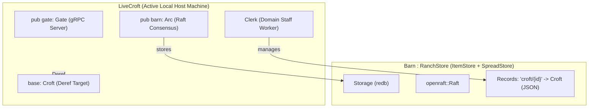

# [Plan] Croft Data Entity and LiveCroft Runtime Model

This technical plan implements the **`Croft`** base data entity, the
**`LiveCroft`** runtime specialization, and aligns the storage subsystem with
**`ItemStore`** and **`RanchStore`**.

We achieve this by:

1. Defining the standard `ItemStore` key-value trait (with associated type
   `Item`) and `RanchStore` in `src/store/`.
2. Defining `Croft` in `src/croft/types.rs` as the primary serializable domain
   entity.
3. Defining `LiveCroft` in `src/croft/mod.rs` embedding `base: Croft`, required
   `barn: Arc<Barn>`, and required `gate: Gate`, with
   `std::ops::Deref<Target = Croft>`.
4. Refactoring `Clerk` and gRPC endpoints in `src/croft/clerk/` to work directly
   with `Croft` and `ProtoCroft`.
5. Refactoring `Regent` in `src/regent/mod.rs` to coordinate `LiveCroft` and
   manage joins with `Croft`.

See [goal.md](./goal.md) for the product context and requirements.

## Architecture



### Module / File Changes

- `src/store/`:
  - Create `src/store/item.rs` (defining `ItemStore` and
    `ItemStoreEvent<K, I>`), delete `src/store/seed.rs`.
  - Update `src/store/ranch.rs` (defining
    `RanchStore: Store + ItemStore<Key = String, Item = Vec<u8>> + SpreadStore`).
  - Update `src/store/mod.rs` and `src/store/README.md`.
- `src/store/barn/`:
  - `events.rs`: `Event::ItemCreated`, `Event::ItemPatched`,
    `Event::ItemRemoved` and
    `TryFrom<Event> for ItemStoreEvent<String, Vec<u8>>`.
  - `storage.rs`: emit `ItemStoreEvent`s over broadcast channel.
  - `mod.rs`: `impl ItemStore for Barn` with
    `type Key = String; type Item = Vec<u8>;` and `impl RanchStore for Barn`.
  - `README.md`: update documentation.
- `src/croft/`:
  - `types.rs`: define `pub struct Croft` with `id`, `name`, `addr`, `roles`,
    `tags`, `joined_at`, `is_server()`, `is_worker()`.
  - `mod.rs`: define
    `pub struct LiveCroft { base: Croft, pub barn: Arc<Barn>, pub gate: Gate }`,
    `impl Deref<Target = Croft>`, `LiveCroft::spawn`, `LiveCroft::persist`.
  - `clerk/mod.rs`: `Clerk` takes `Arc<LiveCroft>`, `get`, `list`, `join`
    operate on `Croft`.
  - `clerk/api.rs`: implement `TryFrom<JoinReq> for Croft`,
    `TryFrom<ProtoCroft> for Croft`, and `From<Croft> for ProtoCroft`.
  - `README.md`: document `Croft` and `LiveCroft`.
- `src/regent/`:
  - `mod.rs`: update `start`, `bootstrap_join`, and `dial_join` to use
    `LiveCroft` and `Croft`.
  - `README.md`: update documentation.

---

## Implementation Details

### 1. `ItemStore` and `ItemStoreEvent` (`src/store/item.rs`)

```rust
use super::core::Store;
use std::error::Error;

/// Custom store event emitted by item stores on item lifecycle mutations.
#[derive(Debug, Clone, PartialEq, Eq)]
pub enum ItemStoreEvent<K, I> {
  ItemCreated(K, I),
  ItemPatched(K, I),
  ItemRemoved(K),
}

/// Generic key-value store holding entity items.
#[async_trait::async_trait]
pub trait ItemStore: Store
where
  Self::Event: TryInto<ItemStoreEvent<Self::Key, Self::Item>>,
{
  type Key: Clone + Send + Sync + 'static;
  type Item: Clone + Send + Sync + 'static;

  fn slice(&self, prefix: &str) -> Self
  where
    Self: Sized;

  async fn get(&self, key: &Self::Key) -> Result<Option<Self::Item>, Box<dyn Error>>;
  async fn set(&self, key: &Self::Key, item: Self::Item) -> Result<(), Box<dyn Error>>;
  async fn delete(&self, key: &Self::Key) -> Result<(), Box<dyn Error>>;
  async fn list(&self, prefix: Option<&Self::Key>) -> Result<Vec<(Self::Key, Self::Item)>, Box<dyn Error>>;
}
```

### 2. `RanchStore` (`src/store/ranch.rs`)

```rust
pub trait RanchStore:
  Store<Event = Self::RanchEvent>
  + ItemStore<Key = String, Item = Vec<u8>>
  + SpreadStore
{
  type RanchEvent: Clone
    + Send
    + Sync
    + 'static
    + TryInto<ItemStoreEvent<String, Vec<u8>>>
    + TryInto<SpreadStoreEvent<Self::Node>>;
}
```

### 3. `Croft` Base Data Entity (`src/croft/types.rs`)

```rust
use serde::{Deserialize, Serialize};

/// Domain entity representing a Croft's identity and metadata on the Ranch.
#[derive(Clone, Debug, PartialEq, Eq, Serialize, Deserialize, Default)]
pub struct Croft {
  pub id: u64,
  pub name: String,
  pub addr: String,
  pub roles: Vec<CroftRole>,
  pub tags: Vec<String>,
  pub joined_at: String,
}

impl Croft {
  pub fn is_server(&self) -> bool {
    self.roles.contains(&CroftRole::Server)
  }

  pub fn is_worker(&self) -> bool {
    self.roles.contains(&CroftRole::Worker)
  }
}
```

### 4. `LiveCroft` Runtime Specialization (`src/croft/mod.rs`)

```rust
use std::ops::Deref;
use std::sync::Arc;
use crate::croft::types::Croft;
use crate::store::ItemStore;
use crate::store::barn::{Barn, Config as BarnConfig};

/// Active local runtime compound of a host machine on the Ranch.
#[derive(Clone)]
pub struct LiveCroft {
  base: Croft,
  pub barn: Arc<Barn>,
  pub gate: Gate,
}

impl Deref for LiveCroft {
  type Target = Croft;

  fn deref(&self) -> &Self::Target {
    &self.base
  }
}

impl LiveCroft {
  pub async fn spawn(config: &Config) -> Result<Self, Box<dyn Error>> {
    let id = Self::id_provide(&config.data_dir)?;
    let gate = Gate::new();
    let barn = Arc::new(
      Barn::spawn(
        &gate,
        BarnConfig {
          id,
          addr: config.addr.to_string(),
          data_dir: config.data_dir.join("data"),
          heartbeat_interval: 100,
          election_timeout_min: 300,
          election_timeout_max: 600,
        },
      )
      .await?,
    );

    let base = Croft {
      id,
      name: config.name.clone(),
      addr: config.addr.to_string(),
      roles: config.roles.clone(),
      tags: config.tags.clone(),
      joined_at: chrono::Utc::now().to_rfc3339(),
    };

    Ok(Self { base, barn, gate })
  }

  pub async fn persist(&self) -> Result<(), Box<dyn Error>> {
    let key = format!("{}{}", CROFT_PREFIX, self.id);
    let payload = serde_json::to_vec(&self.base)?;
    self.barn.set(&key, payload).await?;
    Ok(())
  }
}
```

### 5. `CroftClerk` & Conversions (`src/croft/clerk/`)

- `Clerk::get(&self, id: u64) -> Result<Option<Croft>, Box<dyn Error>>`
- `Clerk::list(&self) -> Result<Vec<Croft>, Box<dyn Error>>`
- `Clerk::join(&self, mut incoming: Croft) -> Result<Vec<Croft>, Box<dyn Error>>`
- `src/croft/clerk/api.rs`:
  - `impl TryFrom<JoinReq> for Croft`
  - `impl TryFrom<ProtoCroft> for Croft`
  - `impl From<Croft> for ProtoCroft`

### 6. `Regent` Coordination (`src/regent/mod.rs`)

- Boots `LiveCroft::spawn(&config).await?`.
- Hires `Clerk::spawn(live_croft.clone())?`.
- Calls `dial_join(&peer, &live_croft).await?` (coerced automatically as
  `&Croft`).
- Listens on `live_croft.gate.listen(bind_addr)`.
